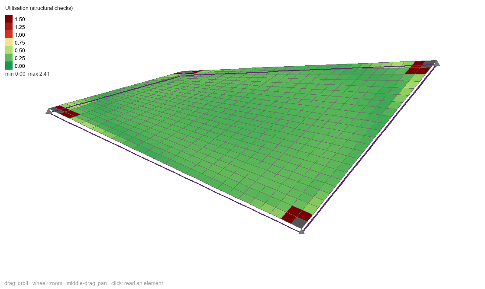
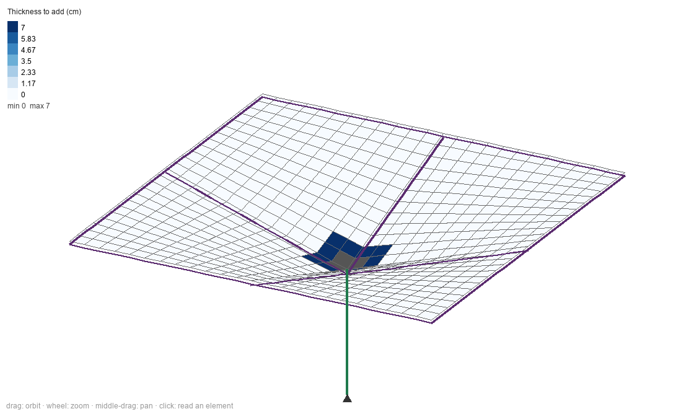
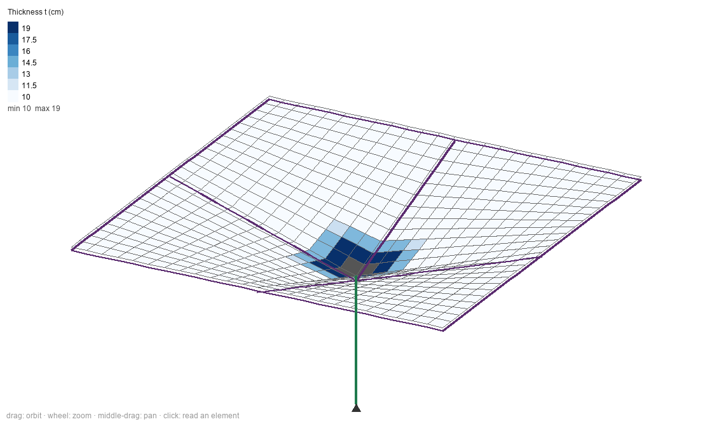

# Shell (RC) tab — build report, 2026-09-15

Follows `DIAGNOSIS_SHELL_2026-09-14.md` and `PLAN_SHELL_2026-09-14.md`.
An eighth tab, **Shell (RC)**, designs reinforced-concrete shells —
hyperbolic paraboloids first, but any surface you can write as z = f(x, y) —
under uniform and non-uniform vertical loads and horizontal / wind loads, and
shows where the shell has to be thicker, then (only if you switch it on)
thickens it.

---

## 0. The short version

- **It works end to end**: type the surface, press *Analyze & design*, read
  the forces, the steel, the thickness each part needs, and the report.
  Every preset analyses and designs in 0.2–0.5 s.
- **The engine is checked against published answers**: flat plate (series
  solution), Scordelis–Lo roof (the standard shell test), membrane theory for
  the hypar, and equilibrium in every load case (force residual about
  10⁻⁷ N on loads of hundreds of kN).
- **Four things you should know before trusting a design** (section 4):
  1. CIRSOC 201-2024 has **no shell chapter** — the shell rules come from
     CIRSOC 201-2005 until CIRSOC 201.03 is published.
  2. The wind speeds in the tab are **CIRSOC 102-2005** speeds; under the
     2024 code the tab multiplies wind by 1.6 so the combination is right.
  3. With the 2024 draft's **35 mm cover** for a roof exposed to the weather,
     no shell can be thinner than about **8.6 cm** (one central mesh) or
     **12.2 cm** (two meshes).
  4. Supports and columns are **solid blocks** of a stated size, not points —
     a point support makes the numbers next to it meaningless.
- Tests: 38 formula + 26 shell-engine + 25 shell-interface tests, all passing;
  full-suite result in section 7.

---

## 1. How to use it

### 1.1 The Definitions page (the GeoGebra part)

The left panel's first page is a list of definitions, one per line, typed the
way GeoGebra takes them:

    a = 12                       a number — gets a slider
    f = 3                        a number — gets a slider
    z(x, y) = 2 f x y / (a b)    the surface
    t = 0.10                     the thickness, in metres (may be a formula)

- `^` is power, `2x` and `x y` multiply, `sin cos sqrt exp ln abs min max`
  and `If(condition, a, b)` are there, `·` `×` `²` are understood.
- A green dot means the line is valid; red, with the reason underneath.
  An error only marks the lines that depend on it.
- **Drag a slider and the surface redraws at once.** The analysis runs only
  when you press *Analyze & design* (about a second).
- The input line at the bottom adds a definition — or, like GeoGebra,
  redefines one if the name already exists (`f = 4`).
- *Surface is* / *thickness is* choose which names are the surface and the
  thickness. A thickness can vary: `t = 0.08 + 0.04 (x/a)^2`.
- The plan limits accept formulas (`-a/2` … `a/2`). Element size (default
  0.5 m) sets the mesh.

### 1.2 The other pages

- **Supports**: at corners / the two lowest corners / an edge / all edges /
  a point, holding x y z, everything, or z only; point supports sit on a
  solid block (default 1.0 m). **Edge beams and ribs**: on any edge, all
  edges, or a line `x=0` / `y=0` across the shell; hanging below, centred or
  standing above. **Columns** with a solid head (capital).
- **Loads**: load cases (D, L, Lr, S, W, E) and loads, each a formula in x, y:
  vertical per m² of plan, vertical per m² of surface, pressure normal to the
  surface (wind), horizontal x / y per m² of surface or of projected area,
  point loads. Self-weight is automatic. **Wind**: pick a city (CIRSOC 102
  Fig. 1B) or type V, exposure, category, height; the tab shows qz. *Add a
  wind case with this pattern* creates a W case with `qz*G*(Cp pattern)`.
- **Design**: the code (CIRSOC 201-2024 draft, or 2005), f'c, fy, cover, bar
  size, one or two meshes (or automatic), exposure, the buckling reduction,
  the thickness limits and taper, and **thickening zones you draw** as rules
  (`abs(x) < 1 and abs(y) < 1  →  t ≥ 20 cm`).

### 1.3 Reading the results

The **Show** list colours the surface by any result: the membrane forces
(Nx, Ny, Nxy, principal N1/N2), moments, transverse shear, deflection, steel
per face and direction, the utilisation of each check, which check governs,
the **thickness needed** and the **thickness to add**. The **for** list picks
a load case, a combination, or the envelope. *Principal directions* draws the
tension (red) and compression (blue) directions. **Click an element** to read
all its numbers underneath. *Section cut…* plots any result along an x or y
line. *Report* writes the calculation; *Export Excel* saves the model and the
results, *Import Excel* reads the model back.

### 1.4 Thicker where needed — show first, then the toggle

As you asked: *Analyze & design* **only shows** where and how much thicker
the shell must be (maps *Thickness needed* / *Thickness to add*); nothing
changes. Switch on **Automatic thickening** and *Analyze & design* raises the
elements that need it (in steps, tapered into the thinner shell around them
at the taper you set), re-analyses — a thicker patch attracts more force —
and repeats until everything passes. *Clear thickening* removes it.

*Saddle hypar, 10 cm: structural utilisation. Green shell; the rings round the
four corner support blocks fail (shear into the blocks).*

*Inverted umbrella, show-first: only the ring round the column head needs
more thickness (+7 cm).*

*After automatic thickening: 19 cm at the head, tapering to 10 cm; everything
passes after three passes.*

(The images are the canvas's own drawing, read back item by item — the screen
was locked while this was built, so an ordinary screenshot only showed the
lock screen.)

---

## 2. What is inside

| file | what |
|---|---|
| `formula.py` | the shared formula language + the GeoGebra-style workspace (Stereo uses it too now) |
| `view3d.py` | orbiting 3-D camera, colour scales (shared; Stereo can move onto it later) |
| `apps/shell/shell_fe.py` | MITC4 shell element, 3-D beam element, sparse solve, free-motion check |
| `apps/shell/shell_model.py` | the model: presets, mesh, supports, blocks, beams, columns, loads, analysis, combinations |
| `apps/shell/shell_codes.py` | design codes as swappable classes (CIRSOC 201-2024 draft, CIRSOC 201-2005) |
| `apps/shell/shell_design.py` | RC design per element, thickness needed, punching at blocks, edge beams, thickening |
| `apps/shell/shell_wind.py` | CIRSOC 102-2005 velocity pressure and starting-point Cp patterns |
| `apps/shell/shell_reports.py` | the written report and the Excel round trip |
| `apps/shell/shell_app.py` | the tab |
| `units.py` | four new quantities: kN/m², kN·m/m, cm²/m, kN/m³ |

**The design method, in one paragraph.** For every element and every
combination, the membrane forces and moments are split onto a top and a
bottom layer of steel (the "sandwich" method) — or, with one central mesh,
the membrane steel plus the bending about it — and each layer gets the steel
it needs in x and y by the standard rule for orthogonal reinforcement
(Nielsen). Then: concrete compression, transverse shear without stirrups
(CIRSOC 201-2024 Tabla 22.5.5.1 with its size effect), buckling (classical
local formula × your reduction factor), bar spacing and fit, minimum steel,
room for the meshes and cover, and — at every support block and column head —
the shear the shell delivers into it, on the code's critical perimeter
(Tabla 22.6.5.2). The smallest thickness at which every check passes is the
*thickness needed*.

---

## 3. Verification

### 3.1 The element against published answers

| test | result | reference |
|---|---|---|
| simply-supported plate, centre deflection (32×32) | 0.004075 qa⁴/D | 0.004062 (series) |
| same, centre moment | 0.04788 qa² | 0.0479 |
| Scordelis–Lo roof, mid free-edge deflection | 0.2991 (ratio 0.989) | 0.3024 |
| rotation-about-normal stabiliser, 10⁻⁵ vs 10⁻³ | identical to 4 digits | — |
| 40×40 mesh stiffness + solve | 0.2 s + 0.2 s | — |

### 3.2 The hypar against membrane theory

Membrane theory says a hypar z = k x y under a load q per m² of plan carries
pure shear Nxy = q/(2k), provided the edge members do not deform. With the
edge beams made progressively stiffer, the tab's interior shear goes to that
value:

| edge beams | FE interior Nxy | theory | ratio |
|---|---|---|---|
| 25 × 50 cm | 12.43 kN/m | 12.00 | 1.036 |
| 50 × 100 cm | 12.15 | 12.00 | 1.012 |
| 100 × 200 cm | 12.06 | 12.00 | 1.005 |

and interior Nx stays near zero. With realistic beams the shell carries 3–10 %
more shear than the formula, because real edge beams stretch and bend. The
report prints this comparison for any hypar you analyse (section 6 of the
report), with the ratio and that explanation.

### 3.3 Mesh independence

Away from supports, results do not move with the mesh (hypar central Nxy
21.29 → 21.23 kN/m from 10×10 to 40×40). Right next to a point support they
do — see 4.4 — which is why supports are blocks. With the blocks resolved,
the shear delivered into a block is stable (saddle corner: 107 kN on a
30×30 mesh, 100 kN on 40×40; the 20×20 mesh cannot resolve a 1 m block and is
flagged) and the thickness needed around it agrees between meshes
(saddle 15–17 cm, dome corners 22–24 cm, umbrella head 15–17 cm). A mesh too
coarse to resolve a block is flagged in the results and the report.

### 3.4 Through the interface (25 tests, all passing)

| area | cases | result |
|---|---|---|
| every preset × every colour map × every case / combination / envelope | 5 presets, 30 maps | pass |
| slider redraws the surface without analysing; results marked stale | | pass |
| bad definition: red mark, reason shown, analysis refused politely | | pass |
| input bar redefines (GeoGebra behaviour); new function added | | pass |
| another function chosen as the surface | | pass |
| plan limits as formulas, element size | | pass |
| supports that let the shell slide → refused, with the node and direction named | | pass |
| tables: add / delete a rib; a non-number refused, not stored | | pass |
| point load stored in kN and applied | | pass |
| wind case from a pattern; W combined at 1.6 (2005 speeds, 2024 code) | | pass |
| switch to CIRSOC 201-2005 combinations | | pass |
| show first (nothing changes), then automatic thickening, then clear | | pass |
| a drawn zone thickens exactly where its rule holds | | pass |
| click an element / click empty space | | pass |
| section cut along x and along y | | pass |
| report has every section and the CIRSOC 201.03 note | | pass |
| Excel export → other preset → import → identical displacements | | pass |
| extreme zoom, deformed shape, principal directions, every view | | pass |
| unit switch is cosmetic; boxes don't drift on focus-out | | pass |
| legend and readout follow the convention (kip/ft in AISC) | | pass |

Plus the app-wide unit tests now include the Shell tab (6 more, pass).

### 3.5 Bugs found while building, and fixed

- **A shell that could slide sideways was solved instead of refused.** The
  sparse solver does not fail on such a system; it returns a wrong
  factorisation. The check now solves for a random load and measures how well
  the answer satisfies the equations (10⁻¹² for a sound model, 216 for that
  one) before trusting anything. Regression test added.
- **"Thickness needed" was over-stated by up to 0.6 cm** (the search grid
  skipped the present thickness) — made every element look like it needed
  thickening. Fixed.
- **The automatic layer spread each raised spot over the whole shell**
  (nearest-point lookup with no distance limit). Fixed; regression tested.
- **Half-attached elements were treated as part of a support block**, which
  zeroed the shear into it on some meshes. Fixed.
- **The support-block shear check was invisible in the maps** (not folded
  into the elements' numbers). Fixed; the default map is now *structural
  utilisation*, with the detailing minimum kept as its own map.
- **Unit round-trip drift**: an untouched box could store 29.99999 MPa after
  a look at AISC. Fixed.

---

## 4. Things to know before trusting a design

### 4.1 CIRSOC 201-2024 has no shell chapter

Its clause **C 1.2.10.7** says shells and folded plates must follow the
*Recomendación CIRSOC 201.03-2024*, which is still being written — the same
move ACI made when it split shells out of ACI 318 into ACI 318.2. So:

- general rules (load combinations Tabla 5.3.1, φ Tabla 21.2.1, Ec, fr, shear
  Tabla 22.5.5.1, punching Tabla 22.6.5.2, minimum steel 24.4.3.2, spacing
  24.4.3.3, cover Tabla 20.5.1.3.1, strut efficiency Tabla 23.4.3) are read
  off the 2024 draft you supplied;
- the shell rules (f'c ≥ 21 MPa, fy ≤ 420 MPa, 3t spacing where membrane
  tension is high, one-face steel repeated on the other face) come from
  CIRSOC 201-2005 Chapter 19, whose text I have not read. The report lists
  them under "verify before sign-off".

If you have CIRSOC 201-2005 or ACI 318.2, send it and I will check those
values.

### 4.2 Wind: which speeds, which factor

CIRSOC 201-2024 combines **1.0 W** because it expects the new CIRSOC 102-2024
speeds, which are larger ("ultimate") values. The city table in the tab is
**CIRSOC 102-2005**, whose speeds went with **1.6 W**. Using 2005 speeds with
the 2024 factors would under-count wind by 1.6, so the tab knows which
edition the speed comes from (*Speed from CIRSOC 102-*) and multiplies W by
1.6 when needed — exactly reproducing the old factors. If you enter a 2024
speed, set that field to 2024.

**No code gives pressure coefficients for a hypar.** The Cp patterns are
starting points, labelled approximate everywhere; use wind-tunnel or
published data for the real form.

### 4.3 Cover sets a minimum thickness

For a roof exposed to the weather, the 2024 draft (Tabla 20.5.1.3.1) asks for
35 mm of cover (bars up to 16 mm, controlled execution). With 8 mm bars that
alone means **8.6 cm** with one central mesh, **12.2 cm** with two. Thin
historic shells (Candela's were 4 cm) would not comply as-is; the future
shell recommendation may relax this. The presets are therefore 10 cm, and
the design page shows the minimum for whatever cover and bar you choose.

### 4.4 Supports are blocks, not points

A shell sitting on a single point is a mathematical singularity: the shear
next to the point grows without limit as the mesh gets finer (measured: 0.76
→ 3.32 at a hypar corner). No real shell sits on a point, so every point
support and column is a **rigid solid block** of a stated size (support block
1.0 m by default, column head from the column table). The check there is the
code's: the total shear the shell delivers into the block, on a perimeter
d/2 outside it — mesh-independent. The element values right beside a block
still depend on the mesh a little, and the report says so.

### 4.5 Buckling

The code requires buckling to be investigated but gives no formula. The tab
uses the classical local formula (Et²/R√(3(1−ν²)), R the radius of curvature
along the compression) × a reduction factor you set (default 0.20, which
covers imperfections, creep and cracking together). It is a check, not a
buckling analysis; a full eigenvalue buckling analysis is listed below as a
possible next step.

---

## 5. The plan against what was built

Built as planned, or better: formula language and workspace with sliders;
MITC4 + beam engine; supports, edge beams, ribs, columns; every load type;
free-motion refusal; per-element RC design; thickness needed; show-first +
automatic thickening + drawn zones; CIRSOC 102 wind; combinations and
envelope; colour maps, principal directions, deformed shape, click readout,
section cuts; report; Excel round trip; unit selector. Added beyond the plan:
support blocks and column heads with the code's punching check (needed once
the point-support problem showed up), the 2024-draft code class (you sent the
2024 draft rather than 2005), and the wind-edition scaling.

**Planned but not built** (say if you want any of them next):

- Benchmarks: the pinched hemisphere and the clamped-hypar test (plate,
  Scordelis–Lo and the membrane comparison were done). The test that the edge
  beam's axial force grows linearly to Nxy × length was not written.
- A numerical membrane solution for any shallow surface (only the hypar's
  closed form is compared).
- Presets: "two raised corners" and "four-hypar groined vault" (built:
  saddle, one raised corner, inverted umbrella, barrel vault, dome).
- A plan view with contour lines (the *Top* view shows the colour map from
  above, without contour lines); load arrows in the 3-D view.
- Drawing a thickening zone as a rectangle with the mouse (zones are typed
  rules).
- Diagrams of the edge-beam forces (they are in the report as numbers).

## 6. Open items (offered, not built)

1. **ACI 318-19 and Eurocode 2** — the code layer is ready; each is one class.
2. **CIRSOC 201.03** — replace the 2005 shell rules when it is issued.
3. **CIRSOC 102-2024 wind speeds** — the city table is 2005.
4. **Global buckling analysis** (eigenvalue), beyond the local check.
5. **Non-rectangular plans** (a domain rule, as Stereo has).
6. **Stereo tab**: move it onto the shared 3-D camera (`view3d.py`), and wire
   its ~25 input fields to the unit selector (its labels already state their
   units, so nothing it shows is wrong).
7. Edge-beam design is **preliminary** (tension steel for N + M, a simplified
   N–M check, stirrups); a full N–M interaction is a next step.

---

## 7. Test suite

Environment note: on this machine Tcl occasionally fails to read its own
start-up files when many windows are created in quick succession
("couldn't read file …/init.tcl: No error"). The suites then SKIP a
window test as "no display". This is the file-access policy noted in earlier
sessions, not an app fault: it moves between tests from run to run, and 25
build-analyse-destroy cycles outside pytest never fail.

**Full suite, 2026-09-15: 1302 passed, 0 failed, 0 skipped, in 6 min 0 s**
(the 2026-09-10 handoff recorded 1145; the difference is the Stereo,
formula, shell-engine, shell-interface and new unit tests). That run
happened to hit no Tcl start-up hiccup.
