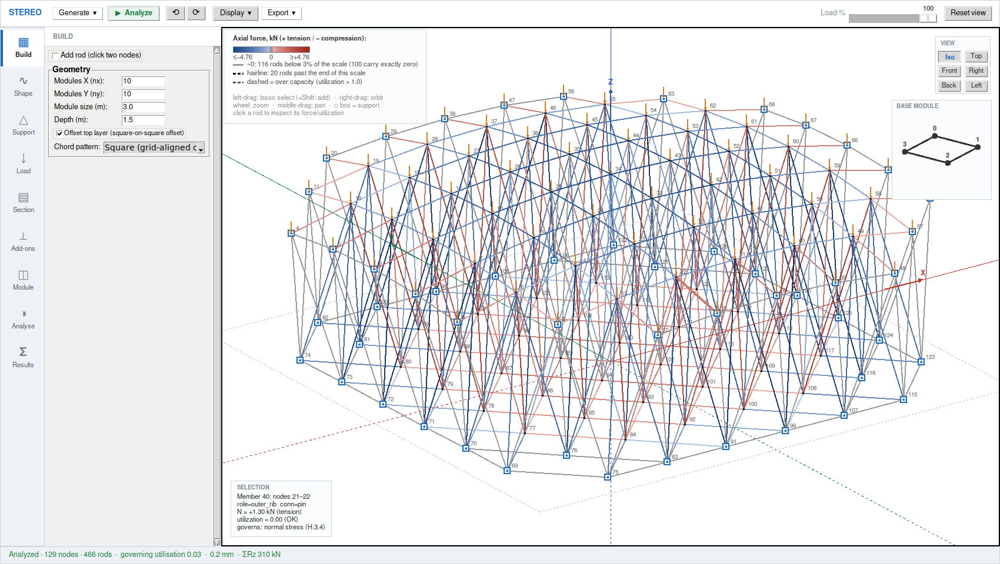
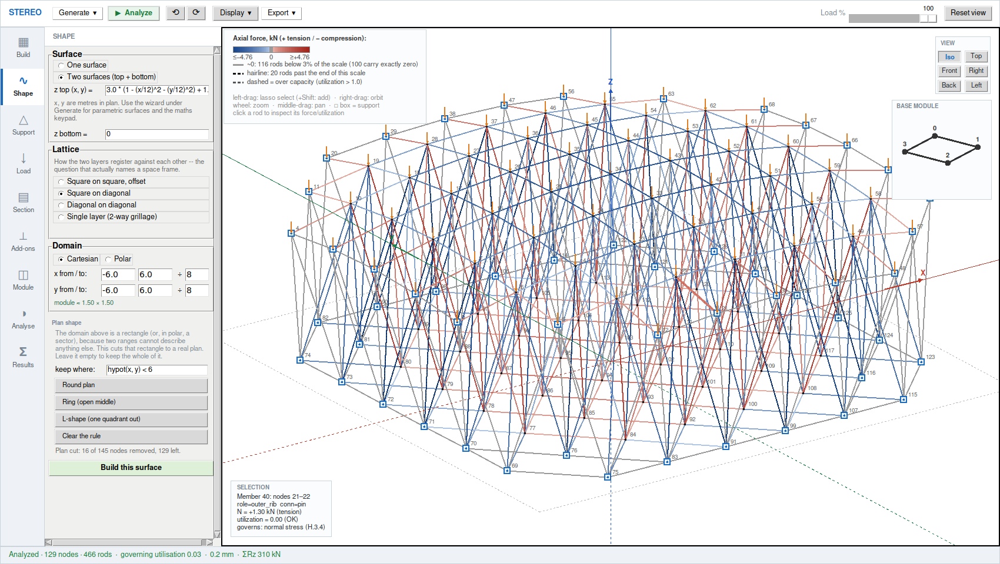
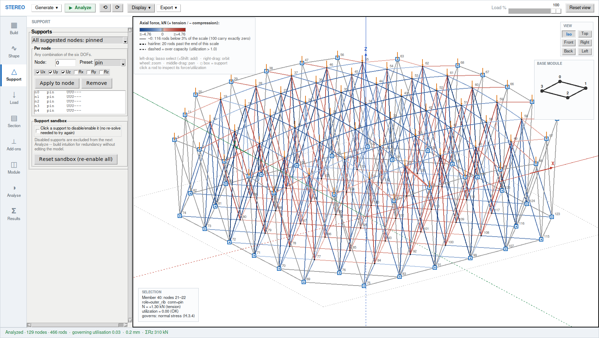
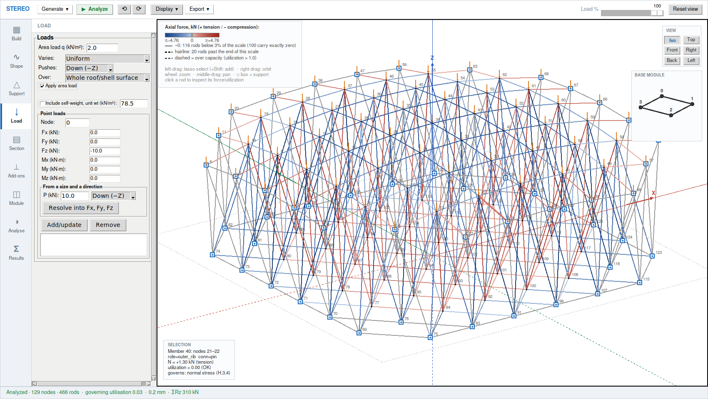
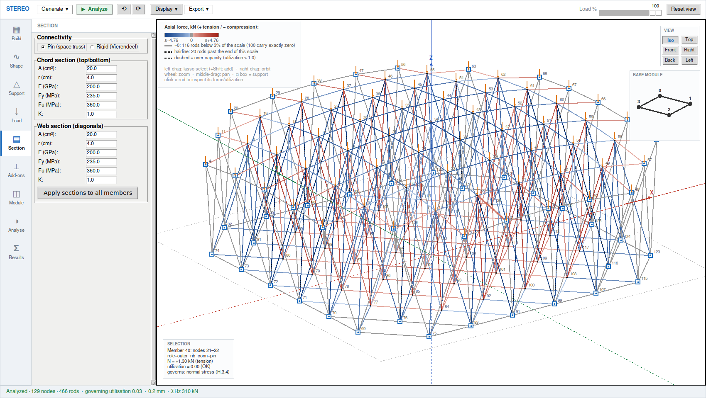
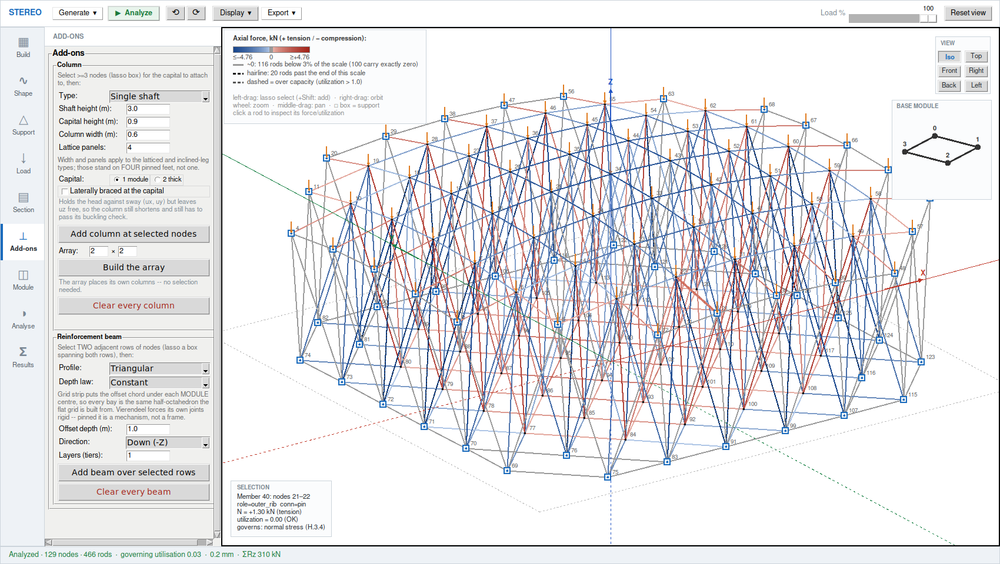
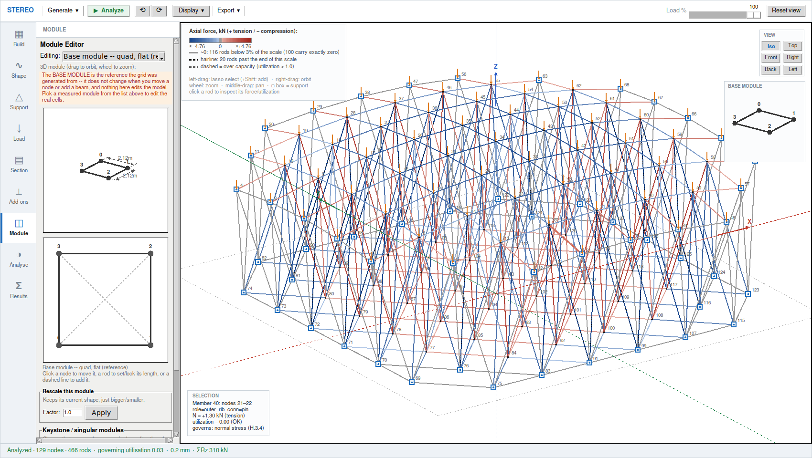
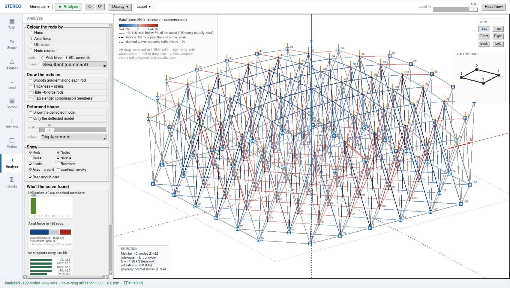
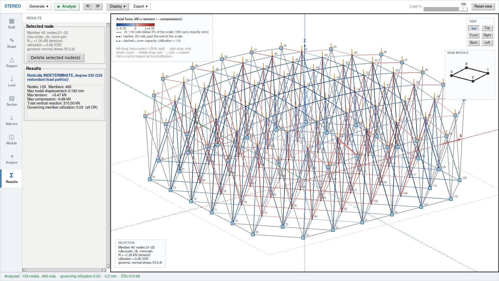

# Stereo tab — complete feature list

The space-truss (3D space-frame) calculator. Everything below is in the app
today and covered by tests. Branch `claude/stereo-ui-rebuild`, 2150+ tests
passing. Last UI rebuild 2026-09-19; see §8 for the window, and
`stereo_ui_modes/` for a screenshot of each of the eight modes.

Names in `code font` are the identifiers in the source, so anything here can be
found by grepping.

---

## 1. The solver

`apps/stereo/stereo_math.py` — direct stiffness, 3D, linear elastic,
small-deflection. Solves in SI; the UI converts at the boundary.

**Two element types, mixable in one model.**

- **Pin** (`conn='pin'`) — 3 translational DOF per node, axial force only.
  The classic space truss.
- **Rigid** (`conn='rigid'`) — 6 DOF per node (3 translations + 3 rotations),
  full 12×12 frame element with axial, 2 bending planes, torsion and shear
  terms. This is what a Vierendeel needs; pinned, a Vierendeel is a mechanism.

**Per-member properties.** `E` (GPa), `A` (cm²), `r` (radius of gyration, cm),
`I` (cm⁴), `J` (cm⁴), `K` (effective-length factor), `Fy`, `Fu` (MPa).
Chord and web members carry independent property sets (`_apply_sections`), so a
grid can have heavy chords and light webs without editing members one by one.

**Supports.** Any combination of the 6 DOF per node, set individually or by
preset: `free`, `pin`, `fixed`, `rollerX`, `rollerY`, `rollerZ`, `custom`.
Quick actions apply a preset to every suggested node at once.

**Loads.**
- Nodal point loads: `fx fy fz mx my mz`, any number of nodes at once.
- Self-weight (`self_weight_loads`) from member volume × unit weight.
- Area load over the generator's own exact tributary areas.
- `combine_loads` layers any number of load lists.

**Outputs.** Nodal displacements, reactions (forces and moments),
per-member axial force `N`, and for rigid members the local end actions
`Vy Vz T My_a Mz_a My_b Mz_b`.

**Diagnostics.**
- `degree_of_indeterminacy` — Maxwell count, reported in the UI.
- `check_boundary_setup` — catches a floating node, a missing load path, and
  insufficient restraint *before* the matrix goes singular, so the user gets a
  sentence instead of a LinAlgError.
- `node_moment_vectors` — the internal moment each rigid member end imposes on
  its joint, in global axes, taking the largest incident end rather than the
  sum (a sum reads ~0 at a continuous joint by equilibrium, which is the
  opposite of useful). Verified against statics: a cantilever of length L with
  tip load P reads exactly P·L, matching its own reaction axis for axis, in all
  three orientations.

**Code checks.** `stereo_checks.py` runs CIRSOC 301 per member: tension yield
and rupture, compression buckling with KL/r, reporting `util` (demand ÷
capacity), the governing `mode`, and a slenderness flag at KL/r > 200.

---

## 2. Geometry — 14 parametric families

Pick a family, set its dimensions, press Generate. Each returns nodes, members
with roles, suggested support nodes, and exact per-node tributary areas.

| Family | Notes |
|---|---|
| Flat double-layer grid | square-on-square, offset or aligned |
| Hyperbolic paraboloid (hypar) shell | |
| Hip (pyramidal) roof grid | |
| Groin (cross) vault | |
| Circular flat grid | polar layout, double layer |
| Barrel vault (circular arch) | |
| Parabolic vault | |
| Elliptic vault | |
| Dome (Schwedler ribs) | meridians + hoops + one diagonal per panel |
| Conical roof (straight rafters) | |
| Paraboloid dish (antenna) | |
| Elliptic dome | |
| Full sphere | |
| Truss bridge (Warren/Pratt-style) | |

**Chord patterns.** `square` (grid-aligned chords) or `diagonal`
(diagonal-on-diagonal). Single or double layer, with or without the offset top
layer, per family.

**Member roles** are tagged at generation (`bottom_chord`, `top_chord`,
`outer_rib`, `inner_rib`, `purlin`, `web`, `capital`, `column_shaft`,
`column_chord`, `column_tie`, `column_web`) and drive the chord/web property
split and the colouring.

---

## 3. Custom Surface Wizard

Build a truss on a surface you write yourself.
`stereo_geometry_custom_surface.py` + `stereo_app_wizard.py`.

**Two ways to define a surface.**
- Height field: `z = f(x, y)`.
- Fully parametric: `x(u,v)`, `y(u,v)`, `z(u,v)` — for anything a height field
  cannot express (torus, helicoid, cylinder).

**Expressions** are compiled by `expr_math.py`, an AST whitelist — no `eval`.
Available: `+ - * / ^`, `sqrt abs exp log log10 log2 sin cos tan asin acos atan
sinh cosh tanh floor ceil min max hypot atan2 pow`, and `pi`, `e`. Also
comparisons and `and` / `or` / `not`, which is what makes a plan-shape *region*
expressible (§3b); chained comparisons (`0 < x < 6`) read the way they are
written, and the boolean operators short-circuit, so a rule can guard its own
domain (`x > 0 and sqrt(x) > 1`).

---

## 3b. Shape mode — surfaces, lattice, plan

The same engine as the wizard, edited in place in a mode instead of a modal
dialog. `_build_shape_panel`, `_build_shape_mesh`, `custom_surface_lattice`.

**Four lattice families**, which is the question that actually *names* a space
frame: not the shape of the surface, nor the pattern drawn on it, but how the
two layers register against each other.

| Lattice | What it is |
|---------|------------|
| Square on square, offset | Bottom layer at the cell centres; webs to the four corners above |
| Square on diagonal | As above plus diagonal chords in the bottom layer |
| Diagonal on diagonal | Diagonal chords in both layers |
| Single layer (2-way grillage) | One layer only — and **flat, with pinned joints, it is a mechanism**, which the panel says before you build it |

**Two guards before anything is built.**
- *Crossing.* Two surfaces that meet or cross anywhere inside the domain are
  refused: where they meet the web has zero length, and past it the truss is
  inside out. The test is local and coordinate-free — sample the separation
  vector and look for neighbouring samples pointing opposite ways.
- *The corner trap.* The domain is a rectangle and most interesting surfaces
  are radial, so **the corners reach 41% further from the centre than the edge
  midpoints do**. A dish sized to clear its bottom layer at the edge midpoints
  can still be 2 m inside out at all four corners. This shipped in a worked
  example once; the crossing check is what catches it now.

**Polar domains** get a pole, and a **summit finder** that searches twice the
current radius — a summit sitting on the rim is exactly the case that says the
pole is misplaced, and a window stopping at the rim cannot see it, because an
edge point is never a summit of the surface, only of the window. More than one
summit means no single pole can serve them, and it says so.

**Plan shape.** Two ranges can only describe a rectangle. A rule over the plan
cuts that rectangle into a real plan — `x^2 + y^2 < 36`, `not (x > 6 and y >
6)`, `hypot(x, y) > 3` — with presets written against the domain currently in
the panel rather than in raw metres. `apply_domain_mask`:

- a node survives if its own position passes the rule, **or** if a web ties it
  to one that does. In a double-layer lattice the bottom nodes sit at the cell
  centres, so this is "judge the module at its centre, then keep the corners it
  needs". The cut is therefore **module-granular**: it overshoots the line by
  at most one module, and that overshoot is the framing around the opening;
- a member survives only if both its ends do, so the chords bounding the hole
  are kept and the edge is framed rather than ragged;
- a node left with nothing attached is dropped, not left floating;
- **supports are re-derived**, not remapped: a cut makes a new free edge, and
  its nodes are exactly the survivors that lost a neighbour to the cut;
- tributary areas are remapped but deliberately **not** recomputed, so a node
  on the cut edge keeps the area it had when it was interior. That
  over-estimates its load, which is the safe direction to be wrong in.

**Maths keypad** modelled on GeoGebra's, in three tabs (`123`, `f(x)`,
`f(x,y)`). Keys *show* real notation — √, π, x², |x|, ×, ÷, sin⁻¹, log₁₀, ⌊x⌋ —
and *insert* the ASCII the parser reads, plus a backspace key. It types into the
field you last clicked, or into the panel's first field if you have not clicked
one.

**Domain.**
- **Cartesian** — p, q are the surface's own x, y. A rectangular window.
- **Polar** — p is a radius, q an angle. A disk, sector or annulus.
  **Full circle** closes the seam (j = n2 welds back to j = 0).
- **pole at (x, y)** — where a polar domain's centre sits on the parameter
  plane. A polar grid's rings follow the surface's contours and its ribs run
  down the fall *only* if the pole is on the summit.
- **Find the summit(s)** (`surface_summits`) — locates every local maximum in
  the window, puts the pole on the highest, and reports the **count**: one
  summit means polar is the right chart; several means no single pole can serve
  them, and it names the alternatives. A surface that only rises towards its
  edge reports no summit rather than sending the pole to a corner.

**Module pattern.** `square`, `diagonal`, or `isometric` (a true 60°
equilateral lattice on an oblique basis — the only pattern that is fully
triangulated on a single layer without help from a web).

**Layer mode.**
- **2D** — one layer lying on the surface.
- **3D** — the surface plus a second layer offset by `depth` along the local
  normal, with `offset_side` choosing which one is the defined surface.
- **Two surfaces** — top and bottom defined independently over one shared
  domain, so the truss depth is a design variable instead of one number.

**Crossing check** (`surfaces_cross`). Two surfaces must stay on their own
sides of each other everywhere in the domain. Where they meet the web has zero
length; past a crossing every web is inverted and the truss is inside out.
Generate refuses a crossed pair and names the point. The test is local and
coordinate-free (each separation vector against its neighbour), so it handles
parametric pairs and does not false-positive on concentric domes. Sampled 3×
finer than the mesh lattice, so a crossing that dips between two nodes is caught.

---

## 4. Add-ons: columns and beams

`stereo_geometry_addons.py`. Select nodes in the 3D view, set dimensions, press
the button.

**Six column styles.**

| Style | What it is | Feet |
|---|---|---|
| `COLUMN_PLAIN` | one vertical strut per selected node, no capital | one per node |
| `COLUMN_SHAFT` | one shaft + a capital fanning to the selected nodes | 1 |
| `COLUMN_LATTICE` | four chords on a square footprint, X-braced, tied at intervals | 4 |
| `COLUMN_TAPERED` | the same lattice narrowing towards the ground | 4 |
| `COLUMN_LEGS` | four inclined struts from a splayed square footprint | 4 |
| `COLUMN_TRIPOD` | three legs at 120°, cannot rock on an uneven footing | 3 |

Parameters: height, **capital height** (how deep the fan is — it changes the
load path), width across flats, panel count, and 1- or 2-tier capitals. A
2-tier capital splits the footprint into four quadrants, fans to an
intermediate node per quadrant, and ties those into a ring (without the ring the
cluster is 2 DOF short of rigid — found by eigenanalysis).

Every foot returned is pinned automatically, because a latticed or splay-footed
column is rigid as a body and one pin leaves three rotations free.

**A column also takes over the supports at the joints it carries**, and says
so in the panel. This is not a nicety: a pin left at the column head is a rigid
path to ground sitting in parallel with the column, and it wins every time.
Measured on a flat grid — a plain post under a pinned corner carried exactly
**0.00 kN** with the old pin still in place, and **23.17 kN** once it was gone.
The column was in the picture, in the member list and in the E3 check, and
carrying nothing.

Columns are ordinary bars, so their axial flexibility is in the solve and their
compression goes through the same CIRSOC **Chapter E3** flexural-buckling check
as every other member (`stereo_checks.check_member`). There is no separate
"model the column as rigid" mode, and none is wanted.

**Laterally braced at the capital** (off by default). A pin-ended column gives
the structure no sway restraint at all. This models the usual real detail --
the roof plane or a bracing bay holding the capital horizontally -- by
restraining ux and uy at the head and leaving **uz free**, so the column still
shortens and still has to pass its buckling check. Holding uz too would be a
rigid prop, which is the very thing the column is there instead of. It is off
by default (the original had it on) because switching it on adds restraints
and moves the answer.

**Build the array** places a regular n x m grid of columns in one action, with
no selection needed. The original laid them out at plan coordinates because
its grid was always a rectangle of known module size; this mesh may be a cut
plan, a dome or a vault, so the array is spread over the model's own plan
extent and each station then snaps to real nodes in the **lowest layer** -- an
(x, y) with no node under it is not somewhere a column can stand, and picking
from every node would hang a column in mid-air under the top chord. Each
station takes its nodes out of the pool, so two columns never share a footing.

**Clear every column** / **Clear every beam** remove all of one add-on at
once. Undo covers removing one, but a model with a dozen columns needed a
dozen undos to reach the bare grid, and by then the stack has eaten everything
else you did in between. Only ORPHANED nodes go: a grid node a capital fanned
to still carries its own chords, and deleting it would tear a hole in the roof
to remove the column under it. Clearing the columns also **hands back the
supports they took over**, or the joints they were carrying would be left
hanging and the next Analyze would report a mechanism for a reason nothing on
screen explains.

**Five beam profiles**, attached to two parallel rows of existing nodes:

| Profile | Cross-section |
|---|---|
| `BEAM_TRIANGLE` | one apex chord on the midline |
| `BEAM_BOX` | two chords directly under the base rows |
| `BEAM_TRAPEZOID` | two chords inboard of the base rows |
| `BEAM_GRID_STRIP` | one offset node per bay under each module centre — a 1×n planar grid mirrored about z, giving half-octahedra |
| `BEAM_VIERENDEEL` | two chords, no diagonals; joints stay rigid (`rigid_required`) |

Each with a **constant** or **parabolic** depth law, any offset direction, and
multi-tier stacking for a deeper girder.

---

## 5. Visualisation

`stereo_app_render.py` + `stereo_app_colors.py`. The legend samples the exact
same colour functions the drawing calls, so the two cannot drift apart.

**Four colour systems.**

| Mode | Ramp | Scaled by |
|---|---|---|
| Axial force | red (tension) ↔ blue (compression), grey at ~0 | this model's own peak or 95th percentile |
| Utilization | green → amber → red | absolute, code-defined (red always means at capacity) |
| Node moment | orange (negative) → white (zero) → violet (positive) | the largest nodal moment in the grid |
| Deformation | pale → saturated green | the largest displacement present |

All are gamma-compressed (0.6) so a model spanning orders of magnitude still
shows contrast. Forces below 3% of the scale are drawn a flat neutral grey and
the legend **counts them**, so a field of grey reads as "these rods carry
nothing" instead of "the drawing failed".

**Moment axis selector** — resultant (signed by the tangential projection
about the structure's own centroid, so two symmetric nodes read the same
colour), or Mx / My / Mz individually.

**Force scale** — peak, or a 95th-percentile anchor with a hairline clip mark
on every rod past the end of the ramp, and a legend row counting them.

**Fill over the wireframe.** **Shaded cells** — the mesh's own closed panels,
depth-sorted (Tk has no z-buffer), coloured by the panel's governing member.

> A surface-Voronoi fill also existed, and was **deleted** in the 2026-09-19
> UI rebuild along with its 286 tests. It is not coming back; do not restore
> it from an older zip expecting the rest of the tab to still fit around it.

**Fill density** — Light / Medium / Heavy / Solid (stipple patterns; Tk has no
alpha channel).

**Overlays and toggles.** Deformed shape (coloured by displacement or by axial
force, with a scale factor); load arrows; reaction arrows; support glyphs;
node and member ID labels; nodes on/off; rods on/off or rods-only; Cartesian
axes drawn as full lines with a ground plane; **smooth per-rod gradient** (each
rod blends between its two end values); **thickness = stress** (|N|/A, capped
at 7 px); **slenderness halos** on compression members over KL/r 200;
**hide ~0-force rods**; **load-path animation** — travelling arrowheads,
inward for tension and outward for compression, each coloured by its own rod's
axial force.

**Load %, 0–100.** The model is linear, so scaling every applied load scales
every result by exactly the same factor. The slider steps the whole display
through the load without re-solving.

---

## 6. Module Editor

**Mode 7** (`stereo_app_module_editor.py`, `stereo_geometry_cells.py`). It was
a 300 px column open whether or not anyone was editing a module; as a mode it
is off screen while you place supports, so the module also appears as a small
**card pinned to the canvas's bottom-right corner**, always showing the base
module as generated whatever the editor itself is currently displaying. The
card is a reference, not a second editor.

- **Cell detection** — finds the mesh's closed triangles and quads.
- **Role classification** — groups congruent cells by signature; role 0 is the
  dominant repeating module, the rest are keystones and one-offs, listed
  separately.
- **Base module** — the grid's *theoretical* module, derived at generation
  (`base_module`) and frozen there. It does not change when you move a node or
  add a beam, because it is a reference drawing, not a measurement. It is
  expressed in its own local frame (so a dome panel reads upright, not tipped
  over at whatever latitude it sat at), and a single-layer surface grid's base
  module comes back **flat** — the curvature belongs to the surface, not the
  plate.
- **3D view** — the module as the real polyhedron it belongs to (ring + apex),
  orbitable and zoomable with its own camera, with CAD-style dimension callouts
  for edge lengths, the module height, and the apex angle, all computed from
  the actual coordinates.
- **2D editor** — the same cell flattened onto its own (u, v) plane. Drag a
  node, set or lock a rod's length, toggle a missing diagonal on.
- **Role-wide propagation** — every edit applies to every cell of that role at
  once, with locked rods protected across all roles.
- **Rescale** a role's cells by a factor.

---

## 7. Editing the model directly

- **Lasso multi-select** on the 3D canvas (drag a box; Shift adds).
- **Add rod** — click two nodes.
- **Delete** selected nodes or a selected member.
- **Click to inspect** a rod: endpoints, role, connectivity, axial force,
  utilisation and the governing check.
- **Undo / redo**, 60 deep, covering every model-changing command.
- **Support sandbox** — click a support to disable it and re-analyze without
  editing the model, to build intuition for redundancy.

---

## 8. The window: eight modes, one canvas

Rebuilt 2026-09-19. The old layout spent 196 px on five rows of toolbar and
kept a 400 px control column and a 300 px Module Editor open at all times,
whether or not you were using either; the canvas got about 60% of the width.
Now it gets about 79%.

**The mode rail** (left, 76 px) holds nine modes. Only one mode's panel is on
screen at a time — the rest are *forgotten* by the geometry manager rather
than hidden, so nothing off-screen keeps claiming space. Each mode answers one
question:

| # | Mode | The question it answers |
|---|------|--------------------------|
| 1 | **Build** | Which of the 14 parametric families, at what dimensions — or which worked example |
| 2 | **Shape** | What surfaces, what lattice, over what domain and plan shape |
| 3 | **Support** | Where the structure stands, and on what boundary conditions |
| 4 | **Load** | What it carries: area load, self-weight, point loads and moments |
| 5 | **Section** | What it is made of: chord and web sections, material, pinned or rigid |
| 6 | **Add-ons** | Columns and reinforcement beams |
| 7 | **Module** | The repeating cell, and edits applied to every congruent copy |
| 8 | **Analyse** | How to draw it, and four charts of what the solve found |
| 9 | **Results** | Reactions, member table, the click-to-inspect readout |

**Alt+1 … Alt+9** jump straight to a mode, in that order; the rail hint names
the shortcut. Alt rather than a bare digit because most of the work here is
typing numbers into fields — the shortcut fires from inside a focused entry
without typing into it.

**The toolbar** (46 px) keeps only what is not a mode: Generate, ▶ Analyze,
undo/redo, the Display popover, Export, and the Load % slider.

**The status bar** (30 px) always reads node and rod counts, governing
utilisation, peak deflection and ΣRz, in the active unit convention.

**Canvas cards**, none of which costs the model any layout width:
- **top-left** — the colour legend and its ramp, over its own ground so the
  numbers stay legible against the structure behind them;
- **top-right** — the **view cube**: Iso / Top / Front / Right / Back / Left.
  Orbiting by hand unlights the preset, because a button still pressed in
  after the camera moved would be a lie about where you are looking from;
- **bottom-left** — the **selection card**, the click-to-inspect readout for
  whatever node or rod you last clicked. It is on the canvas rather than in a
  panel because it used to live in Results, which meant inspecting a rod while
  placing supports wrote the answer onto a panel that was not on screen;
- **under the view cube**, in the same right-hand column — the **base module
  card**, the grid's reference cell, always showing the module as generated
  whatever the Module Editor is currently displaying. **Drag it to turn the
  module**: it shares the editor's camera, so the two views of that one solid
  can never face different ways. The model's own camera stays separate.

**Camera.** Left-drag lassoes, right-drag orbits, wheel zooms, middle-drag
pans. Reset view re-frames the model and **fits the zoom to it**: PX_PER_M is
a fixed 20 px/m, so without a fit the size a model appeared at was decided
purely by how many metres across it happened to be. The Module Editor's 3D
view has a completely separate camera, so orbiting one never moves the other.

**Focus.** Every entry in every panel carries a visible focus ring. Tk's
default focus highlight is the same colour as the background, which across
eight panels of numeric fields meant there was no way to tell which one a
keystroke was about to land in.

### Analyse mode's charts

`stereo_app_analysis.py`. The status bar gives the single governing
utilisation and the member report gives every row; neither answers the
question actually asked after a solve -- *is the structure working as a whole,
or is one member carrying the day?* A governing 0.9 means something different
when six members are near it than when one is and the rest sit at 0.05, and
that shape is what a histogram shows and a table does not.

- **Utilisation histogram**, banded, with over-capacity kept as its own bar
  rather than folded into the top band.
- **Tension / compression split** as one divided bar, because the useful
  reading is the balance: a frame with almost everything in compression is
  saying something about its supports.
- **Support reactions**, tallest first, so an unevenly loaded support line is
  visible rather than inferred from a column of numbers.
- **Cell census** -- how many DISTINCT cell shapes the mesh is made of and how
  dominant the repeating one is. This is the buildability reading: role 0 at
  81% is one module plus edge pieces, role 0 at 30% is a dozen bespoke parts,
  and nothing else in the tab mentions that.

They read only what `analyze` already produced, redraw on entering the mode
and after each solve, and scale with the Load % slider -- a chart one solve
behind the model is worse than no chart, because it still looks authoritative.

### One screenshot per mode

All eight, at 1700×960, of the same solved model — a square-on-diagonal
lattice on a paraboloid, cut to a round plan:

| | | | |
|---|---|---|---|
|  |  |  |  |
| **1 Build** | **2 Shape** | **3 Support** | **4 Load** |
|  |  |  |  |
| **5 Section** | **6 Add-ons** | **7 Module** | **8 Analyse** |
|  | | | |
| **9 Results** | | | |

---

## 9. Units

Five conventions app-wide: **CIRSOC, Eurocode, NBR, CSA, AISC**. The first four
are SI and differ in which sub-unit is customary (cm² vs mm², GPa vs MPa);
AISC is a different system (kip, foot, inch, ksi). Solvers always compute in
SI; conversion happens only at the boundary — labels, entry boxes, tables,
legends and colourbar tick values.

---

## 10. Reports and I/O

- **Member Report** — a sortable table of every rod: endpoints, role,
  connectivity, N, governing mode, utilisation, status, worst first.
- **Excel export** — nodes, members, loads, supports, reactions, member
  results and checks.
- **Excel import** — reads a model back. Note it clears `load_nodes`: an
  imported model has no known roof surface, so the area load must not keep
  applying the previous mesh's tributary areas.
- **Indeterminacy readout** — the Maxwell count with a rigid-body-motion
  caveat.

---

## 11. Eleven worked examples

Each loads a complete scene and **fills the Custom Surface Wizard with the
settings that produced it**, so "how would I make one of these?" is answered by
opening the wizard. Examples not built by the wizard carry a truthful note
naming the generator instead of a recipe that would produce something else.

1. Planar grid + columns (1-tier) + beam
2. Planar grid + columns (2-tier) + multilayer beam
3. Single-surface truss: paraboloid dish (square)
4. Single-surface truss: half-cylinder (isometric)
5. Two-surface truss: dish over flat plane (square)
6. Two-surface truss: concentric domes (polar, diagonal)
7. Barrel vault (circular arch), pinned at both springing lines
8. Schwedler dome, pinned at the base ring
9. Conical roof, pinned at the base ring
10. Groin (cross) vault, pinned at the full base perimeter
11. Truss bridge (Warren/Pratt-style), pinned at the four bearings

---

## 12. Loads, in detail

**Point loads.** All six components on any number of selected nodes at once.
Plus a **size + direction** helper: type a magnitude `P` and pick a direction
(Down −Z, Up +Z, ±X, ±Y, or a typed vector), and it resolves *into* the
Fx/Fy/Fz boxes — so the resolved vector stays visible and editable before
Add/update puts it on the model. It normalises the direction, so |F| is always
the P you typed, and leaves any moments you had typed alone.

**Area load.** Spread over the generator's exact per-node tributary areas.

- **Law**: `Uniform` (one pressure), `Linear gradient` (a ramp between two
  values along X, Y or Z — a drift, a one-sided wind), or
  `q(x, y, z) expression` (anything else, compiled by `expr_math`).
- **Direction**: six presets or a typed vector.
- **Scope**: the whole surface, or the selected nodes only — so half a roof can
  carry a drift while the other half does not. Nodes outside the scope get
  **no entry at all**, not a zero one, which is what lets a second load case be
  layered on top of them.
- An expression that will not compile reports in the panel instead of silently
  loading nothing.

**Self-weight** from the members' own volume, at a settable unit weight.

---

## What it does *not* do

Stated plainly so nobody assumes otherwise:

- Linear, small-deflection only. No geometric non-linearity, no form-finding,
  no buckling capacity beyond CIRSOC's member check.
- One load case at a time. `combine_loads` exists but there is no combination
  UI.
- No per-member section rotation for rigid frames — `_local_axes` picks a
  default reference, which matters for non-symmetric sections.
- The Excel round-trip loses the wizard recipe, so an imported model cannot be
  reopened in the wizard.
- No dynamic, thermal or staged-construction analysis.
