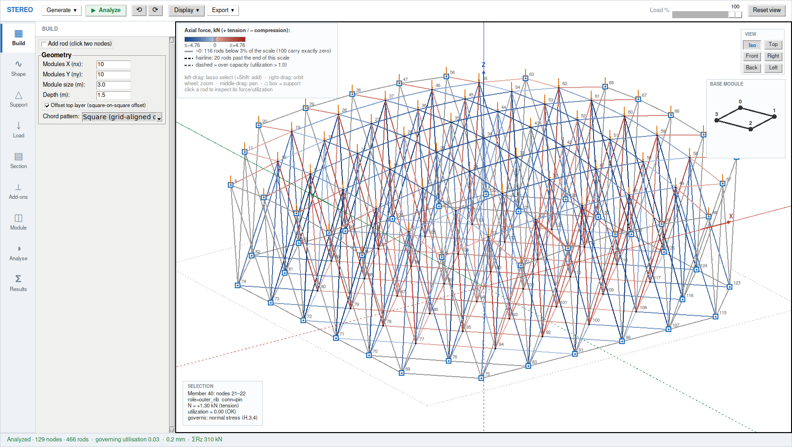
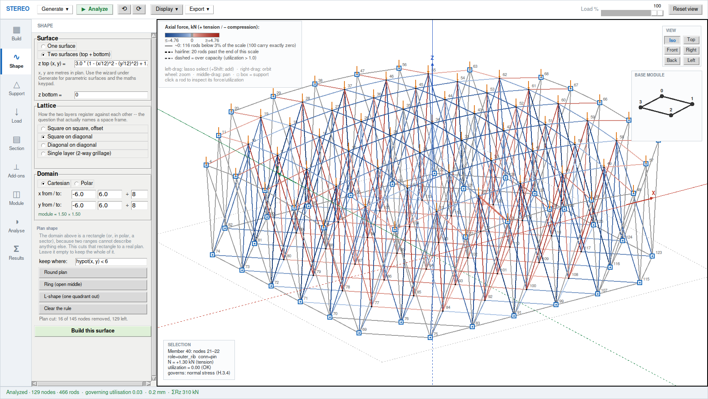
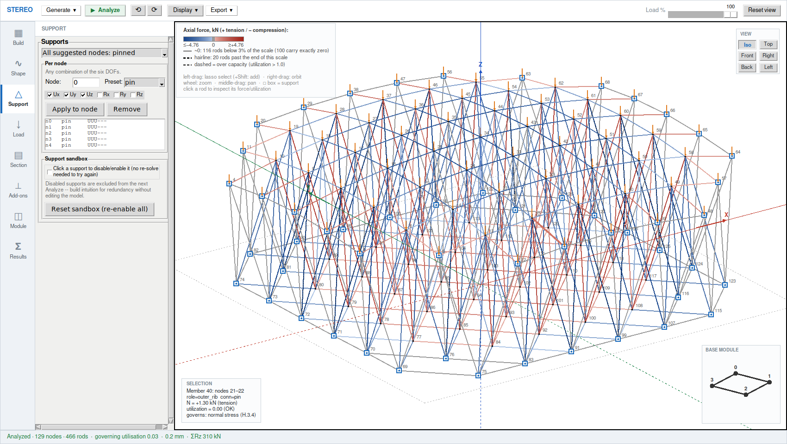
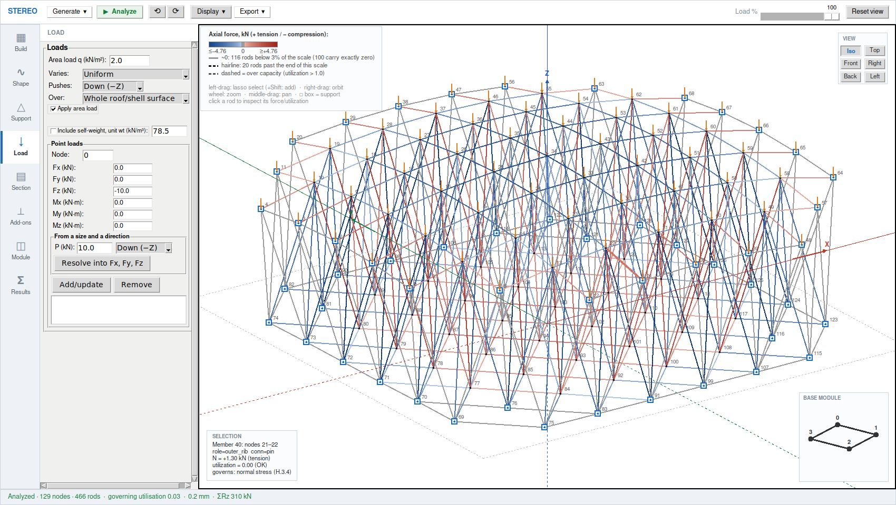
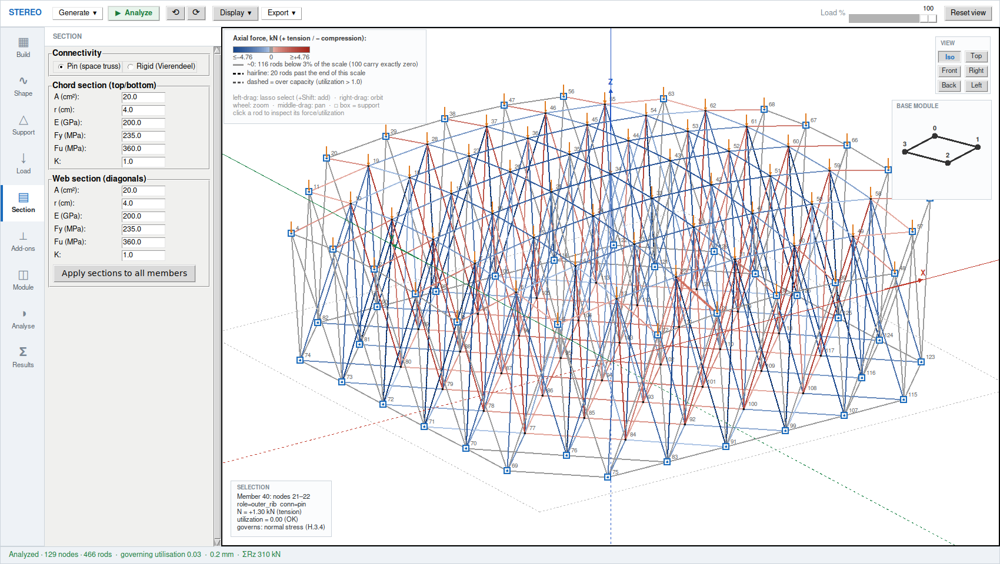
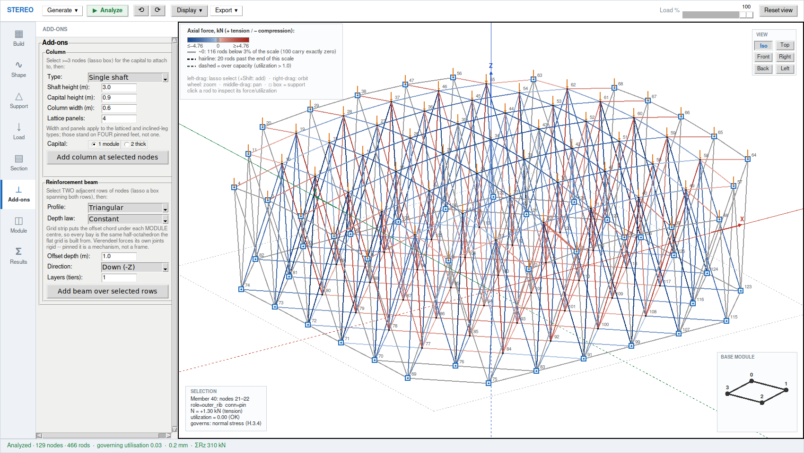
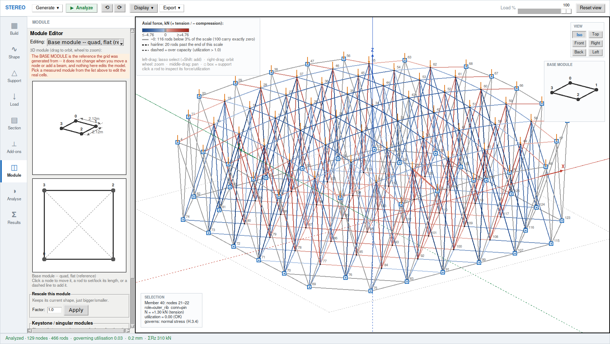
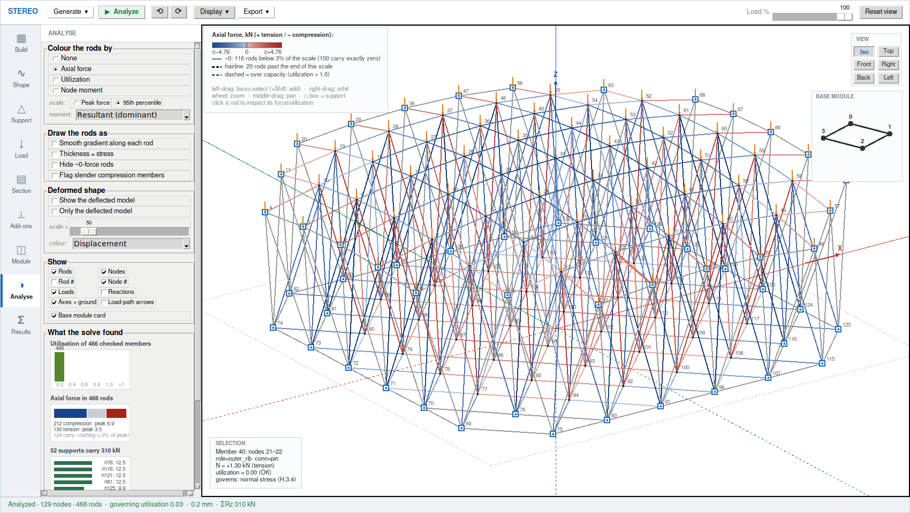
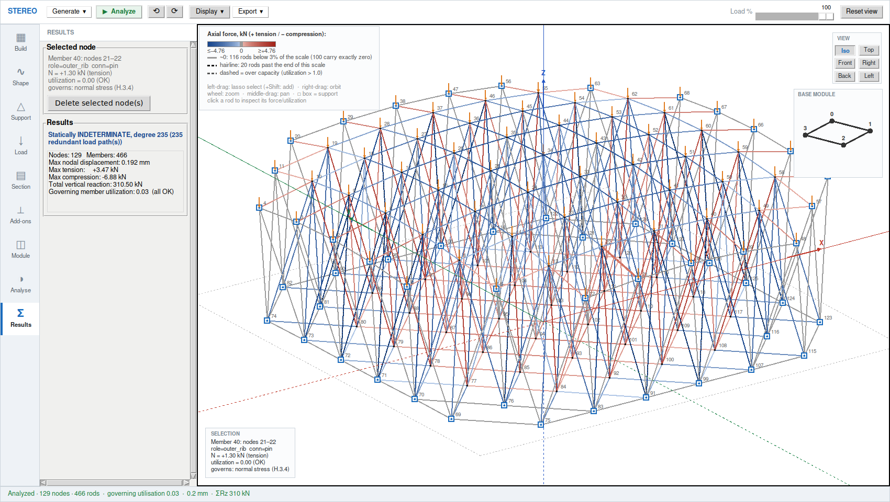

# Stereo tab — complete feature list

The space-truss (3D space-frame) calculator. Everything below is in the app
today and covered by tests. Branch `claude/stereo-ui-rebuild`, 2150+ tests
passing. Last UI rebuild 2026-09-19; see §8 for the window, and
`stereo_ui_modes/` for a screenshot of each of the eight modes.

Names in `code font` are the identifiers in the source, so anything here can be
found by grepping.

---

## 1. The solver

`apps/stereo/stereo_math.py` — direct stiffness, 3D, linear elastic,
small-deflection. Solves in SI; the UI converts at the boundary.

**Two element types, mixable in one model.**

- **Pin** (`conn='pin'`) — 3 translational DOF per node, axial force only.
  The classic space truss.
- **Rigid** (`conn='rigid'`) — 6 DOF per node (3 translations + 3 rotations),
  full 12×12 frame element with axial, 2 bending planes, torsion and shear
  terms. This is what a Vierendeel needs; pinned, a Vierendeel is a mechanism.
  **The two bending planes have their own stiffness.** The strong axis (the
  section's `I`) bends in the vertical plane through the rod — where gravity
  bends a beam; for a vertical column, towards global Y — and the weak axis
  (`Iw`) square to it. Every catalog section carries its weak axis: an IPE 200
  is 13× weaker sideways, which the frame used to ignore by taking both
  stiffnesses as `I`. The member check follows: each moment is checked
  against its own axis's capacity (CIRSOC 301 / AISC 360 H1.1, `Mrx/Mcx +
  Mry/Mcy`). A hand-typed section, which has no weak axis of its own, stays
  doubly symmetric. The weak axis travels with its section — the Excel
  round trip, profiles, the section panels — and is dropped with the depth
  `c` whenever a different I is typed over it.

**Tension-only members (cables).** Any member may carry `tension_only=True`.
Because a cable cannot push, the answer depends on which cables are slack, and
which are slack is not known until it is solved — so `analyze()` solves for it,
by an active-set iteration: solve, drop any cable that came out in compression,
restore any slack cable whose trial force now wants tension, repeat until the
set stops changing. A slack cable is *removed from the stiffness matrix*, not
given a small stiffness (a small stiffness still pushes; the force just gets
small enough to look believable). Slack members report `N = 0.0` with
`slack: True`, keeping the trial force as `N_trial`. If every cable holding the
structure up goes slack, the remainder is a mechanism, and that gets its own
message rather than a singular-matrix error. Models with no cables take the
original path unchanged, at the original cost.

**Per-member properties.** `E` (GPa), `A` (cm²), `r` (radius of gyration, cm),
`I` (cm⁴), `J` (cm⁴), `K` (effective-length factor), `Fy`, `Fu` (MPa).

`r` is the **minor principal** radius — the one a strut buckles about. For an I or
channel that is the web axis, for a rectangular tube the shorter side, and for an
angle the v–v axis at 45° to the legs, which neither geometric axis captures. Until
v24 the steel catalog supplied the *strong*-axis radius instead, overstating
buckling capacity by up to 26× for I-sections and 30× for channels; see the account,
§16. Catalog sections also carry their real extreme-fibre depth `c`, so the bending
check uses `S = I/c` rather than a thin-tube estimate.
Chord and web members carry independent property sets (`_apply_sections`), so a
grid can have heavy chords and light webs without editing members one by one.

**Supports.** Any combination of the 6 DOF per node, set individually or by
preset: `free`, `pin`, `fixed`, `rollerX`, `rollerY`, `rollerZ`, `custom`.
Quick actions apply a preset to every suggested node at once.

**Loads.**
- Nodal point loads: `fx fy fz mx my mz`, any number of nodes at once.
- Self-weight (`self_weight_loads`) from member volume × unit weight.
- Area load over the generator's own exact tributary areas.
- Simplified wind (`stereo_wind.wind_loads`): q × projected area along the
  wind, over the roof surface or over the rods.
- `combine_loads` layers any number of load lists.

**Outputs.** Nodal displacements, reactions (forces and moments),
per-member axial force `N`, and for rigid members the local end actions
`Vy Vz T My_a Mz_a My_b Mz_b`.

**Diagnostics.**
- `degree_of_indeterminacy` — Maxwell count, reported in the UI.
- `check_boundary_setup` — catches a floating node, a missing load path, and
  insufficient restraint *before* the matrix goes singular, so the user gets a
  sentence instead of a LinAlgError.
- `node_moment_vectors` — the internal moment each rigid member end imposes on
  its joint, in global axes, taking the largest incident end rather than the
  sum (a sum reads ~0 at a continuous joint by equilibrium, which is the
  opposite of useful). Verified against statics: a cantilever of length L with
  tip load P reads exactly P·L, matching its own reaction axis for axis, in all
  three orientations.

**Code checks.** `stereo_checks.py` runs CIRSOC 301 per member: tension yield
and rupture, compression buckling with KL/r, reporting `util` (demand ÷
capacity), the governing `mode`, and a slenderness flag at KL/r > 200.

**Timber rods (CIRSOC 601 Supplements).** `stereo_timber.py` carries the
reference design values of every grade in the *Suplementos del Reglamento
CIRSOC 601-2016, Edición 2020-1*: sawn pino paraná, eucalipto grandis, pino
taeda / elliotti, álamo and pino ponderosa (Supplement 1), glulam of the four
IRAM 9660-1 species (Supplement 2) and green eucalipto poles (Supplement 3) —
25 grades, each with Fb, Ft, Fv, Fc⊥, Fc, E, E0,05, Emin and ρ0,05 and the
table it came from. The test file transcribes every row a second time from
the page images.

**Timber…** beside **Catalog…** in Section mode picks a grade and a size
(b × h, or Ø for a pole) and makes it a named profile like any catalog
section, so it applies through the chord / web panels, *Assign profile to
selection*, the Profile Manager and the Groups sheet, and round-trips through
Excel. A timber rod then:

- uses the grade's **E** in the analysis;
- weighs **its own density** — ρ0,05 × g by default, editable in the picker,
  because ρ0,05 is a 5th-percentile value at 12 % moisture and lighter than a
  mean or a wet piece. Self-weight, the take-off, group weights and variants
  all use it, and with timber in the model the PDF's *Steel take-off* sheet
  becomes a *Material take-off*;
- has no Fy/Fu, and is **not** checked to CIRSOC 301.

What it does **not** get is a CIRSOC 601 verification. The Supplements give
values, not the method — they say so themselves (*"para ser utilizados con
los métodos de cálculo que se indican en los Capítulos correspondientes"*).
The adjustment factors (load duration, moisture, temperature, size) and the
column and beam stability rules are in the Reglamento's chapters, which were
not available. So a timber rod is reported `checked=False`: its stresses
(ft or fc, fb about each axis, fv) sit beside the reference values with their
ratios, and for a strut KL/d over the least dimension — with "buckling not
applied" written next to it — but no utilisation is claimed, and it takes no
part in the governing rod or the utilisation colours. Giving a timber rod a
steel catalog section makes it steel again (F-24 unless a steel is named).

**The moment along a rod is one calculation.** The member checks, the
timber stresses and the PDF read a rod's shear and moment from
`stereo_math.member_diagram`; the canvas from
`stereo_member_loads.member_diagram`. The first used to integrate on its
own with the wrong sign on the end moment in the local-y plane, so it did
not close on the solver's own far-end moment: a 3 m cantilever with 5 kN at
its tip read 30 kN·m at the FREE end. Every rigid rod's bending check used
that number -- on the default grid made rigid, 652 of 800 rods were
overstated (peak 3.04 kN·m against a true 1.05), and the error can as well
understate. It now returns the canvas function's values; tests pin it to
the textbook cantilever and to the solver's end moments on a whole frame.

**Large models: a sparse solve.** Above 600 free DOF the stiffness matrix is
assembled and solved sparse (SciPy `spsolve`, with the same residual check
as the dense path); below that the dense solve is kept, since it is faster
there. The answers agree to 1e-8. The default grid analyses about 10× faster
(977 → 102 ms), a 1625-node model 9× (3.2 s → 0.36 s). A displacement over
1000× the model's own span is treated as a singular matrix, not an answer.

**Responsiveness after an analysis.** Moving the mouse no longer redraws the
model: the snap marker is drawn on its own overlay, and the projected screen
positions of the nodes are cached until the view or the geometry changes.
On a 1201-node analysed model a mouse move went from ~95 ms to ~1 ms.

**The side bar's scroll** stops at its content: a panel shorter than the
window does not scroll at all, and a long one cannot be wheeled past its
top, so its first item always sits right under the top edge.

---

## 2. Geometry — 14 parametric families

Pick a family, set its dimensions, press Generate. Each returns nodes, members
with roles, suggested support nodes, and exact per-node tributary areas.

| Family | Notes |
|---|---|
| Flat double-layer grid | square-on-square, offset or aligned |
| Hyperbolic paraboloid (hypar) shell | |
| Hip (pyramidal) roof grid | |
| Groin (cross) vault | |
| Circular flat grid | polar layout, double layer |
| Barrel vault (circular arch) | |
| Parabolic vault | |
| Elliptic vault | |
| Dome (Schwedler ribs) | meridians + hoops + one diagonal per panel |
| Conical roof (straight rafters) | |
| Paraboloid dish (antenna) | |
| Elliptic dome | |
| Full sphere | |
| Truss bridge (Warren/Pratt-style) | |

**Chord patterns.** `square` (grid-aligned chords) or `diagonal`
(diagonal-on-diagonal). Single or double layer, with or without the offset top
layer, per family.

**Member roles** are tagged at generation (`bottom_chord`, `top_chord`,
`outer_rib`, `inner_rib`, `purlin`, `web`, `capital`, `column_shaft`,
`column_chord`, `column_tie`, `column_web`) and drive the chord/web property
split and the colouring.

---

## 3. Custom Surface Wizard

Build a truss on a surface you write yourself.
`stereo_geometry_custom_surface.py` + `stereo_app_wizard.py`.

**Two ways to define a surface.**
- Height field: `z = f(x, y)`.
- Fully parametric: `x(u,v)`, `y(u,v)`, `z(u,v)` — for anything a height field
  cannot express (torus, helicoid, cylinder).

**Expressions** are compiled by `expr_math.py`, an AST whitelist — no `eval`.
Available: `+ - * / ^`, `sqrt abs exp log log10 log2 sin cos tan asin acos atan
sinh cosh tanh floor ceil min max hypot atan2 pow`, and `pi`, `e`. Also
comparisons and `and` / `or` / `not`, which is what makes a plan-shape *region*
expressible (§3b); chained comparisons (`0 < x < 6`) read the way they are
written, and the boolean operators short-circuit, so a rule can guard its own
domain (`x > 0 and sqrt(x) > 1`).

---

## 3b. Shape mode — surfaces, lattice, plan

The same engine as the wizard, edited in place in a mode instead of a modal
dialog. `_build_shape_panel`, `_build_shape_mesh`, `custom_surface_lattice`.

**Four lattice families**, which is the question that actually *names* a space
frame: not the shape of the surface, nor the pattern drawn on it, but how the
two layers register against each other.

| Lattice | What it is |
|---------|------------|
| Square on square, offset | Bottom layer at the cell centres; webs to the four corners above |
| Square on diagonal | As above plus diagonal chords in the bottom layer |
| Diagonal on diagonal | Diagonal chords in both layers |
| Single layer (2-way grillage) | One layer only — and **flat, with pinned joints, it is a mechanism**, which the panel says before you build it |

**Two guards before anything is built.**
- *Crossing.* Two surfaces that meet or cross anywhere inside the domain are
  refused: where they meet the web has zero length, and past it the truss is
  inside out. The test is local and coordinate-free — sample the separation
  vector and look for neighbouring samples pointing opposite ways.
- *The corner trap.* The domain is a rectangle and most interesting surfaces
  are radial, so **the corners reach 41% further from the centre than the edge
  midpoints do**. A dish sized to clear its bottom layer at the edge midpoints
  can still be 2 m inside out at all four corners. This shipped in a worked
  example once; the crossing check is what catches it now.

**Polar domains** get a pole, and a **summit finder** that searches twice the
current radius — a summit sitting on the rim is exactly the case that says the
pole is misplaced, and a window stopping at the rim cannot see it, because an
edge point is never a summit of the surface, only of the window. More than one
summit means no single pole can serve them, and it says so.

**Plan shape.** Two ranges can only describe a rectangle. A rule over the plan
cuts that rectangle into a real plan — `x^2 + y^2 < 36`, `not (x > 6 and y >
6)`, `hypot(x, y) > 3` — with presets written against the domain currently in
the panel rather than in raw metres. `apply_domain_mask`:

- a node survives if its own position passes the rule, **or** if a web ties it
  to one that does. In a double-layer lattice the bottom nodes sit at the cell
  centres, so this is "judge the module at its centre, then keep the corners it
  needs". The cut is therefore **module-granular**: it overshoots the line by
  at most one module, and that overshoot is the framing around the opening;
- a member survives only if both its ends do, so the chords bounding the hole
  are kept and the edge is framed rather than ragged;
- a node left with nothing attached is dropped, not left floating;
- **supports are re-derived**, not remapped: a cut makes a new free edge, and
  its nodes are exactly the survivors that lost a neighbour to the cut;
- tributary areas are remapped but deliberately **not** recomputed, so a node
  on the cut edge keeps the area it had when it was interior. That
  over-estimates its load, which is the safe direction to be wrong in.

**Maths keypad** modelled on GeoGebra's, in three tabs (`123`, `f(x)`,
`f(x,y)`). Keys *show* real notation — √, π, x², |x|, ×, ÷, sin⁻¹, log₁₀, ⌊x⌋ —
and *insert* the ASCII the parser reads, plus a backspace key. It types into the
field you last clicked, or into the panel's first field if you have not clicked
one.

**Domain.**
- **Cartesian** — p, q are the surface's own x, y. A rectangular window.
- **Polar** — p is a radius, q an angle. A disk, sector or annulus.
  **Full circle** closes the seam (j = n2 welds back to j = 0).
- **pole at (x, y)** — where a polar domain's centre sits on the parameter
  plane. A polar grid's rings follow the surface's contours and its ribs run
  down the fall *only* if the pole is on the summit.
- **Find the summit(s)** (`surface_summits`) — locates every local maximum in
  the window, puts the pole on the highest, and reports the **count**: one
  summit means polar is the right chart; several means no single pole can serve
  them, and it names the alternatives. A surface that only rises towards its
  edge reports no summit rather than sending the pole to a corner.

**Module pattern.** `square`, `diagonal`, or `isometric` (a true 60°
equilateral lattice on an oblique basis — the only pattern that is fully
triangulated on a single layer without help from a web).

**Layer mode.**
- **2D** — one layer lying on the surface.
- **3D** — the surface plus a second layer offset by `depth` along the local
  normal, with `offset_side` choosing which one is the defined surface.
- **Two surfaces** — top and bottom defined independently over one shared
  domain, so the truss depth is a design variable instead of one number.

**Crossing check** (`surfaces_cross`). Two surfaces must stay on their own
sides of each other everywhere in the domain. Where they meet the web has zero
length; past a crossing every web is inverted and the truss is inside out.
Generate refuses a crossed pair and names the point. The test is local and
coordinate-free (each separation vector against its neighbour), so it handles
parametric pairs and does not false-positive on concentric domes. Sampled 3×
finer than the mesh lattice, so a crossing that dips between two nodes is caught.

---

## 4. Add-ons: columns, beams and the crane

`stereo_geometry_addons.py`. Select nodes in the 3D view, set dimensions, press
the button.

**Six column styles.**

| Style | What it is | Feet |
|---|---|---|
| `COLUMN_PLAIN` | one vertical strut per selected node, no capital | one per node |
| `COLUMN_SHAFT` | one shaft + a capital fanning to the selected nodes | 1 |
| `COLUMN_LATTICE` | four chords on a square footprint, X-braced, tied at intervals | 4 |
| `COLUMN_TAPERED` | the same lattice narrowing towards the ground | 4 |
| `COLUMN_LEGS` | four inclined struts from a splayed square footprint | 4 |
| `COLUMN_TRIPOD` | three legs at 120°, cannot rock on an uneven footing | 3 |

Parameters: height, **capital height** (how deep the fan is — it changes the
load path), width across flats, panel count, and 1- or 2-tier capitals. A
2-tier capital splits the footprint into four quadrants, fans to an
intermediate node per quadrant, and ties those into a ring (without the ring the
cluster is 2 DOF short of rigid — found by eigenanalysis).

Every foot returned is pinned automatically, because a latticed or splay-footed
column is rigid as a body and one pin leaves three rotations free.

**A column also takes over the supports at the joints it carries**, and says
so in the panel. This is not a nicety: a pin left at the column head is a rigid
path to ground sitting in parallel with the column, and it wins every time.
Measured on a flat grid — a plain post under a pinned corner carried exactly
**0.00 kN** with the old pin still in place, and **23.17 kN** once it was gone.
The column was in the picture, in the member list and in the E3 check, and
carrying nothing.

Columns are ordinary bars, so their axial flexibility is in the solve and their
compression goes through the same CIRSOC **Chapter E3** flexural-buckling check
as every other member (`stereo_checks.check_member`). There is no separate
"model the column as rigid" mode, and none is wanted.

**Laterally braced at the capital** (off by default). A pin-ended column gives
the structure no sway restraint at all. This models the usual real detail --
the roof plane or a bracing bay holding the capital horizontally -- by
restraining ux and uy at the head and leaving **uz free**, so the column still
shortens and still has to pass its buckling check. Holding uz too would be a
rigid prop, which is the very thing the column is there instead of. It is off
by default (the original had it on) because switching it on adds restraints
and moves the answer.

**Build the array** places a regular n x m grid of columns in one action, with
no selection needed. The original laid them out at plan coordinates because
its grid was always a rectangle of known module size; this mesh may be a cut
plan, a dome or a vault, so the array is spread over the model's own plan
extent and each station then snaps to real nodes in the **lowest layer** -- an
(x, y) with no node under it is not somewhere a column can stand, and picking
from every node would hang a column in mid-air under the top chord. Each
station takes its nodes out of the pool, so two columns never share a footing.

**Clear every column** / **Clear every beam** remove all of one add-on at
once. Undo covers removing one, but a model with a dozen columns needed a
dozen undos to reach the bare grid, and by then the stack has eaten everything
else you did in between. Only ORPHANED nodes go: a grid node a capital fanned
to still carries its own chords, and deleting it would tear a hole in the roof
to remove the column under it. Clearing the columns also **hands back the
supports they took over**, or the joints they were carrying would be left
hanging and the next Analyze would report a mechanism for a reason nothing on
screen explains.

**Five beam profiles**, attached to two parallel rows of existing nodes:

| Profile | Cross-section |
|---|---|
| `BEAM_TRIANGLE` | one apex chord on the midline |
| `BEAM_BOX` | two chords directly under the base rows |
| `BEAM_TRAPEZOID` | two chords inboard of the base rows |
| `BEAM_GRID_STRIP` | one offset node per bay under each module centre — a 1×n planar grid mirrored about z, giving half-octahedra |
| `BEAM_VIERENDEEL` | two chords, no diagonals; joints stay rigid (`rigid_required`) |

Each with a **constant** or **parabolic** depth law, any offset direction, and
multi-tier stacking for a deeper girder.

**Cable crane** (`add_cable_crane`). Select three or more joints and press *Lift
the selected nodes* in the Crane group: a hook node goes up above the centroid of
the selection, one **tension-only cable** runs from each selected node to the
hook, and a vertical mast runs from the hook to an anchor above it. This answers
"what happens to my structure while it is being lifted", which is a different
load case from the finished structure and often the governing one.

Hook rise and mast length are typed, or worked out from the spread of the
selection: the mean horizontal distance from the centroid out to the picked
nodes, floored at 0.5 m, which puts the slings near 45° — the angle a rigger
aims for, because steeper wastes height and flatter multiplies the tension for
the same lift. The mast defaults to 35% of the rise. **Clear every crane**
removes each crane member and node by role, so the action is repeatable.

The cables are pinned and tension-only, so the §1 active-set solve applies:
a sling on the slack side of an off-centre lift reads **0.00, slack** instead of
pushing. Compare a guyed mast under a horizontal load — with cables, the
windward guy takes **+16.63 kN** and the leeward one goes slack; with the same
members as ordinary bars, both read **±8.33 kN** and one of them is a strut,
which is not what a guy rope does.

**The lift takes the model off its own supports** (a checkbox, on by default).
A support left in place is a rigid path to ground in parallel with the slings and
it wins every time: with the grid's own supports in, all four slings read exactly
0.000 kN. *Clear every crane* hands them back, kind and all. With the checkbox off
the panel warns you that the slings may read zero.

**It also adds three tag lines**, and it has to. A body hanging from concurrent
cables is a pendulum, and a linear small-deflection solve gives a pendulum no
lateral stiffness at all — the restoring force is a geometric, second-order term
this solver does not carry. Three modes therefore have zero stiffness: swing in x,
swing in y, and spin about the vertical. Unsteadied, the lifted grid's stiffness
matrix has a condition number of 6 × 10¹⁶ — numerically singular — and yet returns
a clean, plausible answer under one load case and displacements of 10¹⁰ m under
another, because the singularity test looks at the residual, which depends on the
loads. A real rig steadies a hanging load the same way. The three restraints are
the minimum and the maximum: at the lifted node furthest out, ux and uy; at the
node furthest from that one, the direction across the line between them. In a
symmetric lift they carry exactly zero, which is the check that they are steadying
and not carrying; a non-zero reaction there is the net horizontal load on the lift,
which has nowhere else to go.

Steadied, the four-sling lift of 1800 kN reads **636.3961 kN** per sling with the
vertical components summing to 1800.0000 kN — 1800/(4·cos 45°), the slings at 45°
as the geometry says.

**Off its supports, the model has to be stable on its own** — and a grid often
is not. The default square-on-square grid, as a free body, has **seven**
zero-stiffness modes, not six: the six rigid-body motions and a free-edge
mechanism its perimeter supports were hiding. Hung from its four corners the
slings hold that part; hung from three corners, or from a patch in the middle,
nothing does, and the solve is singular. The crane checks this the moment it
is added (`stereo_math.mechanism`, the softest mode of the supported stiffness
matrix): it **selects the loose nodes** and says, in the panel and the status
bar, to hook slings there too or keep the model on its supports. Any singular
analysis now says the same — *"Free to move with no stiffness: nodes …"* — and
selects them, rather than only "singular stiffness matrix".

Fixed in the same pass (item 4):

- a **second crane** used to take the first crane's mast support and tag lines
  off as if they were ground; the crane's own supports now stay, and *Clear
  every crane* removes every crane's tag lines, not just the last one's;
- **undo** restores the list of supports the lift took off and the tag lines,
  so a later *Clear* hands back exactly what the model had;
- the **tension-only flag survives Excel** (a `tension_only` column) — a crane
  exported and re-imported used to come back with cables that push;
- a cable set that **never settles** keeps its last pass, with the caveat, where
  it used to leave no result at all;
- a lift that **tips on its slings** (picked well off its centre of load) moves
  further than a linear analysis can describe — the status bar now says so
  whenever the peak displacement passes 5 % of the model's size, rather than
  presenting 12 m of rigid tilt as an answer;
- a solve whose answer moves more than **a thousand times the model's size**
  is refused as the mechanism it is: the residual test alone let one through.

**The mast anchor is fixed, not pinned.** A rigid mast whose top can rotate has
a zero-energy torsional mode about its own axis — the cables are pin-jointed and
add no rotational stiffness at the hook, so nothing resists that rotation and
the solve is singular before any cable has gone slack. The same fact is worth
knowing when reading results: a body hanging from a single hook can spin, so its
rotation about the mast axis is not restrained by the lift itself.

---

## 5. Visualisation

`stereo_app_render.py` + `stereo_app_colors.py`. The legend samples the exact
same colour functions the drawing calls, so the two cannot drift apart.

**Four colour systems.**

| Mode | Ramp | Scaled by |
|---|---|---|
| Axial force | red (tension) ↔ blue (compression), grey at ~0 | this model's own peak or 95th percentile |
| Utilization | green → amber → red | absolute, code-defined (red always means at capacity) |
| Node moment | orange (negative) → white (zero) → violet (positive) | the largest nodal moment in the grid |
| Deformation | pale → saturated green | the largest displacement present |

All are gamma-compressed (0.6) so a model spanning orders of magnitude still
shows contrast. Forces below 3% of the scale are drawn a flat neutral grey and
the legend **counts them**, so a field of grey reads as "these rods carry
nothing" instead of "the drawing failed".

**Moment axis selector** — resultant (signed by the tangential projection
about the structure's own centroid, so two symmetric nodes read the same
colour), or Mx / My / Mz individually.

**Force scale** — peak, or a 95th-percentile anchor with a hairline clip mark
on every rod past the end of the ramp, and a legend row counting them.

**Fill over the wireframe.** **Shaded cells** — the mesh's own closed panels,
depth-sorted (Tk has no z-buffer), coloured by the panel's governing member.

> A surface-Voronoi fill also existed, and was **deleted** in the 2026-09-19
> UI rebuild along with its 286 tests. It is not coming back; do not restore
> it from an older zip expecting the rest of the tab to still fit around it.

**Fill density** — Light / Medium / Heavy / Solid (stipple patterns; Tk has no
alpha channel).

**Overlays and toggles.** Deformed shape (coloured by displacement or by axial
force, with a scale factor); load arrows; reaction arrows; support glyphs;
node and member ID labels; nodes on/off; rods on/off or rods-only; Cartesian
axes drawn as full lines with a ground plane; **smooth per-rod gradient** (each
rod blends between its two end values); **thickness = stress** (|N|/A, capped
at 7 px); **slenderness halos** on compression members over KL/r 200;
**hide ~0-force rods**; **load-path animation** — travelling arrowheads,
inward for tension and outward for compression, each coloured by its own rod's
axial force.

**Load %, 0–100.** The model is linear, so scaling every applied load scales
every result by exactly the same factor. The slider steps the whole display
through the load without re-solving.

---

## 6. Module Editor

**Mode 7** (`stereo_app_module_editor.py`, `stereo_geometry_cells.py`). It was
a 300 px column open whether or not anyone was editing a module; as a mode it
is off screen while you place supports, so the module also appears as a small
**card pinned to the canvas's bottom-right corner**, always showing the base
module as generated whatever the editor itself is currently displaying. The
card is a reference, not a second editor.

- **Cell detection** — finds the mesh's closed triangles and quads.
- **Role classification** — groups congruent cells by signature; role 0 is the
  dominant repeating module, the rest are keystones and one-offs, listed
  separately.
- **Base module** — the grid's *theoretical* module, derived at generation
  (`base_module`) and frozen there. It does not change when you move a node or
  add a beam, because it is a reference drawing, not a measurement. It is
  expressed in its own local frame (so a dome panel reads upright, not tipped
  over at whatever latitude it sat at), and a single-layer surface grid's base
  module comes back **flat** — the curvature belongs to the surface, not the
  plate.
- **3D view** — the module as the real polyhedron it belongs to (ring + apex),
  orbitable and zoomable with its own camera, with CAD-style dimension callouts
  for edge lengths, the module height, and the apex angle, all computed from
  the actual coordinates.
- **2D editor** — the same cell flattened onto its own (u, v) plane. Drag a
  node, set or lock a rod's length, toggle a missing diagonal on.
- **Role-wide propagation** — every edit applies to every cell of that role at
  once, with locked rods protected across all roles.
- **Rescale** a role's cells by a factor.

---

## 7. Editing the model directly

- **Lasso multi-select** on the 3D canvas (drag a box; Shift adds).
- **Line select** (Build mode, or **L**) — click a node, then another: every
  node the straight run between them passes through is selected, measured in
  the model (not on screen, so nothing on another layer that merely looks
  close comes along), **and every rod along that run**. A dashed line follows
  the cursor to the far end while the tool waits. **Shift** on the far end
  adds to the selection and carries on from that node, so an L of supports or
  a ring is a chain of Shift-clicks; **Esc** stops. *Also the rods the line
  crosses on screen* takes the rods the drawn line passes through as well
  (`stereo_select`).
- **Add rod** — click two nodes.
- **Delete** selected nodes or a selected member.
- **Click to inspect** a rod: endpoints, role, connectivity, axial force,
  utilisation and the governing check.
- **Rotate / mirror the selection** (Build mode, or keys) — the arrow keys
  pick the axis (←→ X, ↑↓ Y, PgUp/PgDn Z) whether or not a single node is
  selected; **R**, an angle and Enter rotates the selected nodes (and the
  ends of selected rods) about that axis through their own middle; **M**
  mirrors them; **Shift+M** mirrors a **copy**, which is how half a
  structure is drawn and the other half made. The mirror plane is *auto* by
  default — through the middle when flipping in place, at the selection's +
  edge for a copy, so the copy goes alongside rather than on top — or set
  to middle, either edge, or the origin. Copy nodes that land on existing
  ones merge, so the two halves share their joints on the plane; the copy
  brings the originals' supports, roof-load areas and point loads (point
  loads unreflected, so gravity stays down). A locked group turns whole, or
  not at all if it shares a joint with another group.
- **Show me this rod** — wherever a panel names a rod (Results: *Show me
  the governing rod*; a group's section recommendation: its governing rod
  and, when different, its largest-force rod; a group's properties: its
  worst rod), one click selects it, centres the view on it and flags it
  with a magenta halo and a caption saying why. The flag goes when you
  select something else, or when an edit invalidates the solve it came from.
  *Centre on node* in the model tree now really centres (it used to ignore
  the zoom and the model's own centre).
- **Undo / redo**, 60 deep, covering every model-changing command.
- **Support sandbox** — click a support to disable it and re-analyze without
  editing the model, to build intuition for redundancy.

### Groups are layers

A group is a named set of rods — a branch of the structure. The **Groups
(layers)** box sits in **Build**, right under the selection tools it is used
with: select (click, lasso, *Line select*), then **New group from
selection** (or **Ctrl+G** on the canvas), **Add selection to group** or
**Remove from group**. *Actions ▾* holds the rest (properties, move,
rename, delete, PDF); *More group tools* folds away the section, checks and
reports.

Every group **and every subgroup** is a closed object, at every depth alike:

- **Dragging any of its nodes moves the whole group**, subgroups included.
  Its parts do not move on their own, cannot be typed to new coordinates,
  and its rods cannot be deleted or have their properties edited.
- **Rods can still be drawn to its nodes.** The new rod is Ungrouped — the
  object it was drawn from is unchanged.
- **Move group…** moves it by a typed (dx, dy, dz).
- A group that **shares a joint with another group** will not move on its
  own: the joint belongs to both. The status line names the joint. Select a
  node of each to move them together. Ungrouped rods at its joints are not
  an object, so they stretch to follow.
- Its **section** can still be set from the Groups panel, and the panel-wide
  *Apply sections* (which every add-on also runs) leaves it alone.
- A rod leaves a locked group only while that group is open, so adding a
  selection to one branch can never silently empty another.

**Editing groups in Excel.** *Export Excel* writes a **Groups** sheet, one
row per group: id, name, parent, its own rods as ranges (`0-39, 45`), then
profile, conn, E, A, I, J, Fy, Fu, K, r_gyr and c. Edit it and *Import from
Excel*:

- a **filled** cell sets that value on every rod of the row; a **blank** one
  leaves each rod as it is. A cell is exported blank when the group's rods
  disagree, and the *info: mixed* column says which;
- a **profile** name (catalog, or a name from the Model sheet's profiles)
  sets the whole section, and numbers you **changed** in the same row go on
  top — numbers still as exported do not, so changing only the profile gives
  the whole catalog section;
- changing **I** without a new **c** drops the old catalog depth, which
  belonged to the old section;
- a row sets its **own** rods; a subgroup has its own row;
- **rods** can be moved between rows, rows added or deleted — the groups
  come back as the sheet says. A rod in two rows, a rod the model does not
  have, a missing parent or a group nested in itself stops the import with
  the reason, and the model is left as it was;
- importing a workbook you did not edit changes nothing. Afterwards a box
  lists every change the sheet made.

Imports used to drop groups entirely; a workbook exported from a grouped
model now comes back grouped.

**Plain and Coloured by group.** The Groups box's *Show* switch sets how the
model is drawn. *Coloured by group* gives every object in the current
context its own pale tint — a halo under its rods, so force, utilisation and
moment colours still read on top — and a key naming them in the corner: the
top-level groups, or, with a group open, its subgroups (which are tinted
then even in the plain view, because they are closed objects there). The
locks hold in both: the switch is a view, and opening a group is the only
way to change its parts.

**Section properties.** The section recommendation shows the recommended
section's own table — A, Ix, Iy, J, both radii of gyration (the minor one
labelled as the one buckling uses), c, Wx and kg/m, with Iv for angles —
and a group's properties box shows the section its rods carry (or, in a
mixed group, the one most of them carry, and says so). Values come from
nominal plate dimensions without root fillets, a few per cent under
published tables, and the box says that too.

**Opening a group.** **Right-click** it — its row in the list, or one of its
rods on the canvas — or pick it and press *Open group*. Its **own** nodes
and rods can then be moved, deleted and added to; new rods join it; a new
group made from a selection nests inside it. Its **subgroups stay closed**:
inside the open group each one moves whole, as a top-level group does in the
model, and right-clicking one of its rods opens it in turn (the strip under
the list reads *Editing: Roof › Bay A › Truss 1*). **Everything outside the
open group is blocked**: faded on the drawing but still there for context,
not selectable, and refused by every tool. A blue frame and banner say what
is open. **Done**, **Esc** or a right-click on empty canvas steps back out
one level — to the group it was opened from, then to the whole model. Undo
covers all of it: the groups are part of every undo step.

---

## 8. The window: nine modes, one canvas

Rebuilt 2026-09-19. The old layout spent 196 px on five rows of toolbar and
kept a 400 px control column and a 300 px Module Editor open at all times,
whether or not you were using either; the canvas got about 60% of the width.
Now it gets about 79%.

**The mode rail** (left, 76 px) holds nine modes. Only one mode's panel is on
screen at a time — the rest are *forgotten* by the geometry manager rather
than hidden, so nothing off-screen keeps claiming space. Each mode answers one
question:

| # | Mode | The question it answers |
|---|------|--------------------------|
| 1 | **Build** | Which of the 14 parametric families, at what dimensions — or which worked example |
| 2 | **Shape** | What surfaces, what lattice, over what domain and plan shape |
| 3 | **Support** | Where the structure stands, and on what boundary conditions |
| 4 | **Load** | What it carries: area load, self-weight, simplified wind, point loads and moments |
| 5 | **Section** | What it is made of: chord and web sections, material, pinned or rigid |
| 6 | **Add-ons** | Columns, reinforcement beams, and the cable crane |
| 7 | **Module** | The repeating cell, and edits applied to every congruent copy |
| 8 | **Analyse** | How to draw it, and four charts of what the solve found |
| 9 | **Results** | Reactions, member table, the click-to-inspect readout |

**Alt+1 … Alt+9** jump straight to a mode, in that order; the rail hint names
the shortcut. Alt rather than a bare digit because most of the work here is
typing numbers into fields — the shortcut fires from inside a focused entry
without typing into it.

**The toolbar** (46 px) keeps only what is not a mode: Generate, ▶ Analyze,
undo/redo, the Display popover, Export, and the Load % slider.

**The status bar** (30 px) always reads node and rod counts, governing
utilisation, peak deflection and ΣRz, in the active unit convention.

**Canvas cards**, none of which costs the model any layout width:
- **top-left** — the colour legend and its ramp, over its own ground so the
  numbers stay legible against the structure behind them;
- **top-right** — the **view cube**: Iso / Top / Front / Right / Back / Left.
  Orbiting by hand unlights the preset, because a button still pressed in
  after the camera moved would be a lie about where you are looking from;
- **bottom-left** — the **selection card**, the click-to-inspect readout for
  whatever node or rod you last clicked. It is on the canvas rather than in a
  panel because it used to live in Results, which meant inspecting a rod while
  placing supports wrote the answer onto a panel that was not on screen;
- **under the view cube**, in the same right-hand column — the **base module
  card**, the grid's reference cell, always showing the module as generated
  whatever the Module Editor is currently displaying. **Drag it to turn the
  module**: it shares the editor's camera, so the two views of that one solid
  can never face different ways. The model's own camera stays separate.

**Camera.** Left-drag lassoes, right-drag orbits, wheel zooms, middle-drag
pans. Reset view re-frames the model and **fits the zoom to it**: PX_PER_M is
a fixed 20 px/m, so without a fit the size a model appeared at was decided
purely by how many metres across it happened to be. The Module Editor's 3D
view has a completely separate camera, so orbiting one never moves the other.

**Focus.** Every entry in every panel carries a visible focus ring. Tk's
default focus highlight is the same colour as the background, which across
eight panels of numeric fields meant there was no way to tell which one a
keystroke was about to land in.

### Analyse mode's charts

`stereo_app_analysis.py`. The status bar gives the single governing
utilisation and the member report gives every row; neither answers the
question actually asked after a solve -- *is the structure working as a whole,
or is one member carrying the day?* A governing 0.9 means something different
when six members are near it than when one is and the rest sit at 0.05, and
that shape is what a histogram shows and a table does not.

- **Utilisation histogram**, banded, with over-capacity kept as its own bar
  rather than folded into the top band.
- **Tension / compression split** as one divided bar, because the useful
  reading is the balance: a frame with almost everything in compression is
  saying something about its supports.
- **Support reactions**, tallest first, so an unevenly loaded support line is
  visible rather than inferred from a column of numbers.
- **Cell census** -- how many DISTINCT cell shapes the mesh is made of and how
  dominant the repeating one is. This is the buildability reading: role 0 at
  81% is one module plus edge pieces, role 0 at 30% is a dozen bespoke parts,
  and nothing else in the tab mentions that.

They read only what `analyze` already produced, redraw on entering the mode
and after each solve, and scale with the Load % slider -- a chart one solve
behind the model is worse than no chart, because it still looks authoritative.

### One screenshot per mode

All eight, at 1700×960, of the same solved model — a square-on-diagonal
lattice on a paraboloid, cut to a round plan:

| | | | |
|---|---|---|---|
|  |  |  |  |
| **1 Build** | **2 Shape** | **3 Support** | **4 Load** |
|  |  |  |  |
| **5 Section** | **6 Add-ons** | **7 Module** | **8 Analyse** |
|  | | | |
| **9 Results** | | | |

---

## 9. Units

Five conventions app-wide: **CIRSOC, Eurocode, NBR, CSA, AISC**. The first four
are SI and differ in which sub-unit is customary (cm² vs mm², GPa vs MPa);
AISC is a different system (kip, foot, inch, ksi). Solvers always compute in
SI; conversion happens only at the boundary — labels, entry boxes, tables,
legends and colourbar tick values.

That boundary now includes the **self-weight unit weight** box (pcf under
AISC; the model keeps kN/m³, so switching the display never changes the
load), the **PDF take-off note**, and the **Excel workbook**: every sheet a
person reads — Summary, Nodes, Members, Loads, Node Properties, Member
Forces, Reactions, Member Checks, Member Calculations, Gusset Plates — is
written in the selected convention, a column's unit named after the
underscore (`N_kip`, `A_in²`). Under the SI conventions nothing changes, so
a workbook read by column name reads the same. The **Model** and **Groups**
sheets stay in the stored units (m, kN, cm, MPa), because Import from Excel
and the SketchUp extension read them by those headers; the Summary sheet
says so.

---

## 10. Reports and I/O

- **Member Report** — a sortable table of every rod: endpoints, role,
  connectivity, N, governing mode, utilisation, status, worst first.
- **Excel export** — nodes, members, loads, supports, reactions, member
  results and checks, in the selected units (see §9). The *Member
  Calculations* sheet shows, for each of the most utilised rods, its place
  in the structure and the free-body diagram at each end — and now, beside
  them, the rod's own data: section, A, r min, L, KL/r, N, V and M max,
  mode, capacity, utilisation and the check that governs.
- **Merge Excel files** — design by parts (roof, columns, bracing, each its
  own workbook) and combine them: pick several files and a tolerance (1 mm
  by default); nodes that close are the same joint, the later files' rods
  are re-indexed onto the combined nodes, and every rod keeps its own
  section — nothing is averaged. At the seams: a rod lying on one already
  there is kept once, with the first file's section; a rod whose ends merge
  is dropped; loads on a shared joint add; supports there combine to the
  stricter (held in either, held in both); each file's groups come along,
  renamed only if a name is taken. Every file is read before the model is
  touched, so a bad one leaves it as it was. A summary per file says what
  merged, as the roadmap asks: *"Merged N nodes, combined M + K members.
  X coincident nodes were merged."* Undo takes the whole merge back.
- **Import from SketchUp** — on the Export menu beside Import Excel: reads
  the workbook the SketchUp extension writes, and says what it lacks (loads
  and supports).
- **Excel import** — reads a model back. Note it clears `load_nodes`: an
  imported model has no known roof surface, so the area load must not keep
  applying the previous mesh's tributary areas — and it switches the area
  load, self-weight and wind generators off, because the exported `[LOADS]`
  table is already the complete case.
- **PDF report** — up to nineteen A4-landscape sheets: the general
  (axonometric) view with the load case; **plan, front, back, right and
  left** over a ghost dimension grid, with every structural level named on
  the elevations; **axial force** and **member utilisation**, each in both
  the general view and plan, with bar thickness reading axial stress; a
  third utilisation sheet scaled to **this model's own range** rather than
  the code threshold; nodal moments; **bending and shear along the rods**
  wherever the model has rigid joints, coloured exactly as the canvas
  colours them (Results → colour by moment / shear along the rod): each
  rod orange → white → violet along its own length, white marking where
  the sign turns, on the same ramp pinned to the same model peak -- one
  general view, then a plan of each rod layer (top chords, bottom chords,
  webs; one plan of all rods for a model without chord roles), with the
  eight rods carrying the most tagged 1-8 at their peak and listed with
  their values;
  the deformed shape; support reactions with an equilibrium check; the
  governing-member schedule; and the **maximum-solicitation** schedules
  for the rods and (on a rigid model) the nodes, each closing on an
  envelope of the worst of every action. Each view sheet carries a title
  block, a horizontal graphic scale bar, an orientation indicator (arrows,
  or the circled dot / circled cross for the axis pointing at the reader),
  one compact colour key mirroring the on-screen legend, and its own
  statistics panel. See `PDF_REPORT_GUIDE_2026-09-27.md`.
- **PDF drawing scale** — every view is fitted to its sheet as large as it
  goes without running under a panel: the key and the stats panel are
  corner blocks at the top, the scale bar and the orientation indicator
  corner blocks at the bottom, and the drawing may use the free middle of
  either edge (the first fit reserved the full width for each, which left
  a squarish model a third of the sheet high). The export dialog's
  *Drawing scale* overrides it: *Zoom* n % of the fit, or a *True scale*
  1 : N on the paper — the scale bar is right either way. The choice is
  remembered for the next export, and the selection and group PDFs use it
  too.
- **Serviceability verdict** — the deformed sheet states the L/250
  allowance (configurable), the span it is taken over, the ratio of worst
  displacement to allowance, and a pass/fail verdict, with the allowance
  marked on the displacement ramp.
- **Steel take-off sheet** — bars, area, total and mean length, kg/m and
  mass per section, ranked by mass, totalling in kg and tonnes, computed
  from the same unit weight the self-weight load case uses.
- **Sheet chooser** — both PDF exports open with a chooser: six groups of
  sheets, the resulting sheet count shown live, and the choice remembered
  for the next export. The general view is always included.
- **The report follows the app-wide unit selector.** Every number on every
  sheet, and the title block's UNITS field, are written in the convention
  selected at export time — so a report made with AISC selected is in ft,
  kip and ksi throughout rather than contradicting the screen it came
  from. Utilisation and the L/n deflection ratio stay unconverted, being
  ratios; the scale bar, grid spacing and triad arm pick their round
  number in the unit they are labelled in.
- **Groups PDF** — the Groups box's *PDF of all groups* / *PDF of this group*:
  one document with a summary and contents sheet, the joints shared between
  groups with the force each side hands across (as many sheets as needed),
  then a section per group. Numbered as one document. See the PDF guide.
- **PDF of Selection** — the same report for the selected group **alone**,
  with the rest of the model cut out rather than dimmed, so nothing
  obstructs it. The title block names both the file and the group.
- **SketchUp `.rb` export** and **IFC 2x3 export** for BIM handover; the
  `CoordinateCoordinatorTrussAppAMAC` SketchUp extension imports Stereo
  models and exports picked geometry back.
- **Design variants** — snapshot the current model plus its solved load
  case, then compare variants side by side on force, displacement,
  utilisation and weight.
- **Indeterminacy readout** — the Maxwell count with a rigid-body-motion
  caveat.

Every export hands out the load case the solver actually used
(`_all_loads()`: point loads *plus* the area load *plus* self-weight *plus*
the simplified wind), not
just the point loads typed into the Loads panel — see
`TestExportsCarryTheSolvedLoadCase` in `tests/test_stereo_app.py`.

---

## 11. Eleven worked examples

Each loads a complete scene and **fills the Custom Surface Wizard with the
settings that produced it**, so "how would I make one of these?" is answered by
opening the wizard. Examples not built by the wizard carry a truthful note
naming the generator instead of a recipe that would produce something else.

1. Planar grid + columns (1-tier) + beam
2. Planar grid + columns (2-tier) + multilayer beam
3. Single-surface truss: paraboloid dish (square)
4. Single-surface truss: half-cylinder (isometric)
5. Two-surface truss: dish over flat plane (square)
6. Two-surface truss: concentric domes (polar, diagonal)
7. Barrel vault (circular arch), pinned at both springing lines
8. Schwedler dome, pinned at the base ring
9. Conical roof, pinned at the base ring
10. Groin (cross) vault, pinned at the full base perimeter
11. Truss bridge (Warren/Pratt-style), pinned at the four bearings

---

## 12. Loads, in detail

**Point loads.** All six components on any number of selected nodes at once.
Plus a **size + direction** helper: type a magnitude `P` and pick a direction
(Down −Z, Up +Z, ±X, ±Y, or a typed vector), and it resolves *into* the
Fx/Fy/Fz boxes — so the resolved vector stays visible and editable before
Add/update puts it on the model. It normalises the direction, so |F| is always
the P you typed, and leaves any moments you had typed alone.

**Area load.** Spread over the generator's exact per-node tributary areas.

- **Law**: `Uniform` (one pressure), `Linear gradient` (a ramp between two
  values along X, Y or Z — a drift, a one-sided wind), or
  `q(x, y, z) expression` (anything else, compiled by `expr_math`).
- **Direction**: six presets or a typed vector.
- **Scope**: the whole surface, or the selected nodes only — so half a roof can
  carry a drift while the other half does not. Nodes outside the scope get
  **no entry at all**, not a zero one, which is what lets a second load case be
  layered on top of them.
- An expression that will not compile reports in the panel instead of silently
  loading nothing.

**Self-weight** from the members' own volume, at a settable unit weight.

**Wind (simplified).** Roadmap 4.6, option 1 (`stereo_wind`): every node
takes `q` times the area the wind *sees*, along the wind. The user gives the
design pressure `q` (kN/m²), the direction the wind blows **towards** (azimuth
0 = +X, 90 = +Y) and its elevation, and says how the wind meets the structure:

- **Sheeted roof** — the roof's own tributary areas, each turned by how
  squarely the surface faces the wind at that node (`A |n·d|`, the normal
  fitted through the node and its roof neighbours). A flat roof under a level
  wind catches nothing; a vault's flank catches it all. Needs a generated or
  shaped model, which knows its roof; the panel says so otherwise.
- **Open rods** — no sheeting: each rod shows the wind its width × length,
  turned by its angle to the wind (`q L b sinθ`), half to each end. The width
  is the catalog depth `2c`, or the round-tube estimate for a hand-typed
  section.

It is **not** CIRSOC 102: no shape or pressure coefficients, no windward /
leeward split, no suction. Those need the standard's tables (option 2). An
imported workbook switches the wind off, like the area load and self-weight,
because its `[LOADS]` already carry it.

---

## What it does *not* do

Stated plainly so nobody assumes otherwise:

- Linear, small-deflection only. No geometric non-linearity, no form-finding,
  no buckling capacity beyond CIRSOC's member check. Tension-only members are
  the one exception, and a narrow one: the solve decides which cables are slack,
  but each active cable is still a straight elastic bar — there is no cable sag,
  no pretension and no large-displacement geometry. The absence of geometric
  stiffness is why a lift has to be steadied by hand (§4): a hanging body's
  restoring force is exactly the term that is missing.
- The crane is a *load case*, not a simulation over time: it answers what the
  structure and the slings do while hanging at one position, not what happens
  during the lift.
- One load case at a time. `combine_loads` exists but there is no combination
  UI.
- No per-member section rotation for rigid frames: the strong axis always
  bends in the vertical plane through the rod (for a column, towards global
  Y). Right for a beam carrying gravity; a section the drawing turns another
  way is not modelled turned.
- A hand-typed section has no weak axis of its own and is still taken as
  doubly symmetric (`Iy = Iz = I`). Catalog sections carry theirs.
- A channel's weak-axis I is taken about its web rather than its centroid
  (UPN 200: 82 against a published 148 cm⁴) — low, so the stiffness and the
  weak-axis capacity are on the safe side; it is the same figure its
  buckling radius has always used.
- The Excel round-trip loses the wizard recipe, so an imported model cannot be
  reopened in the wizard.
- The *Member Calculations* sheet shows the 40 most utilized rods, not all of
  them. Each block carries three rendered images, so all 800 rods of the default
  grid made a 19.7 MB workbook with 2,400 images in it; at 40 it is 1.7 MB. The
  sheet says so, and *Member Forces* and *Member Checks* still cover every rod.
- No dynamic, thermal or staged-construction analysis.
- Timber rods are not verified to CIRSOC 601 — see §1, *Timber rods*: the
  Supplements' reference values are in, the Reglamento's method is not.
  Aluminium is not in at all.
